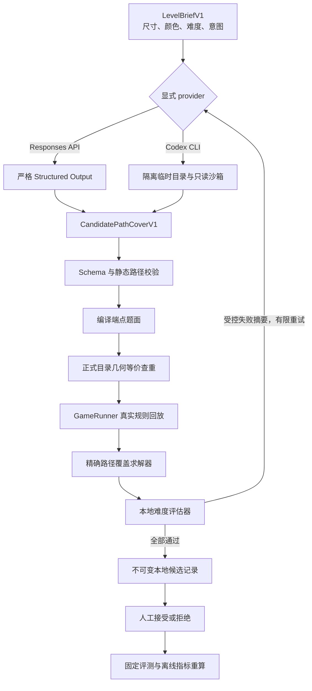

# AI 关卡设计 Copilot V1：作品集案例报告

> 项目：Cleared Mini Game
>
> 状态：开发期本地命令行工具 V1 已验收
>
> 证据日期：2026-09-15
>
> 完整工程合同：[AI 关卡设计 Copilot 实施方案](ai-level-copilot-implementation-plan.md)

> 本报告主体冻结版本 7／`copilot-prompt-v4` 的 V1 验收证据。后续版本 8 已增加 7×7、8×8 与无镂空普通 8×10：独立的 24 例真实 Codex full eval 得到 23 个 reviewable 候选和 1 个运行预算失败，自动难度命中率 95.83%、唯一布局率 95.65%；23 个候选已全部审核，接受 13 个，人工采纳率 56.52%，通过大棋盘总体建议门槛。两批指标保持独立，不改写本文 V1 基线。

## 1. 一句话介绍

这是一个面向普通连线关卡的本地 AI 设计助手：设计者输入棋盘尺寸、颜色数、目标难度和设计意图，模型生成结构化完整路径，本地规则引擎、精确求解器、难度评估器和人工审核共同决定候选能否保留。

它不是“让大模型直接写入游戏”的自动发布工具。模型输出始终被视为不可信输入，任何候选都不能绕过确定性门禁，也不能自动修改正式关卡、小游戏运行代码、CloudBase 或玩家数据。

## 2. 要解决的问题

手工设计连线关卡需要反复完成端点摆放、可解性检查、难度调整、重复排查和试玩筛选。LLM 可以帮助探索布局，但单靠提示词无法可靠保证：

- 路径覆盖全部格子且彼此不重叠；
- 每一步都是合法的上下左右移动；
- 生成题面能被真实游戏规则完成；
- 候选确实可解且没有命中已有正式关卡；
- 难度符合要求，而不是只看模型自述；
- 题面在人工体验上可读、有趣并符合设计意图。

V1 的目标不是替代关卡设计师，而是缩短“从设计要求到可审核候选”的路径，并留下可复现的质量证据。

## 3. V1 范围

V1 支持：

- 普通连线玩法；
- 5×5 与 6×6 棋盘；
- 4—6 条颜色线路；
- 目标难度 1—3；
- 单次最多 3 个候选、5 次 provider 调用和 180 秒总运行时间；
- OpenAI Responses API 与 Codex CLI 两种显式 provider；
- 本地回放、人工审核、固定 smoke/full eval 和离线指标重算。

V1 不支持 Portal、冰封、障碍、8×8、唯一解证明、自动正式导入、小游戏内 AI、云端候选库或多人协作。

## 4. 系统架构



核心设计是“双重权威”：`GameRunner` 证明候选与真实玩法一致，独立求解器从题面重新寻找一份完整解，避免仅仅相信模型提交的答案。

## 5. 严格信任边界

| 风险 | V1 处理方式 | 验证证据 |
| --- | --- | --- |
| 模型输出格式正确但语义非法 | Schema 后继续做覆盖、邻接、重复格和端点检查 | 合同与候选反例测试 |
| 模型给出一份看似正确的答案 | 使用 `GameRunner` 回放，并让精确求解器独立求解 | Validator 测试与 22 例离线 replay |
| 模型自报难度不可信 | 只采用现有本地难度评估器结果 | 固定评测的难度命中率 |
| 生成结果与正式关卡重复 | 对旋转、镜像、换色和端点方向做统一布局指纹 | 8 种几何变换测试 |
| 网络、超时或半完成响应污染结果 | 响应状态、usage 和错误分类单独记录，失败关闭 | Responses/Codex 客户端反例测试 |
| Codex 读取项目或执行工具 | 仓库外临时目录、最小环境、只读沙箱，并禁止 shell、Web、MCP、插件、hook 和 subagent | 假子进程与禁止活动测试 |
| 并发审核覆盖已有决定 | `review.json` 使用文件系统级原子不覆盖写入 | 并发与跨进程冲突测试 |
| 候选进入游戏或云端 | `runs/` 被 Git 和微信包忽略，V1 没有 publish/apply/sync 命令 | 架构边界测试与包体检查 |

关键限制为：每次 provider 调用最长 60 秒，响应或 Codex 输出上限 256 KiB；单次流水线最多 3 个候选、5 次 provider 调用和 180 秒总预算。

## 6. 代码职责

| 模块 | 单一职责 |
| --- | --- |
| `contracts.js` | brief 合同与动态输出 Schema |
| `candidate.js` | 路径静态校验、题面编译与几何等价指纹 |
| `validator.js` | 依次调用正式目录、Runner、求解器和难度评估器 |
| `prompt.js` | 固定 prompt 版本与受控失败反馈 |
| `openai-client.js` | 固定 Responses 请求、响应上限、usage 与错误分类 |
| `codex-client.js` | ChatGPT 登录校验、隔离 Codex 调用与 JSONL 审计 |
| `run-store.js` | 安全权限、秘密扫描和原子 JSON 持久化 |
| `pipeline.js` | 状态机、双重预算、候选重试与 provider 编排 |
| `eval.js` | 固定评测、指标聚合、逐例清单和离线重算 |
| `cli.js` | `validate`、`generate`、`replay`、`review` 命令入口 |

V1 使用项目已有 CommonJS 与 Node 工具链，没有引入 npm 运行依赖、框架、数据库或平行规则实现。

## 7. 评测设计

固定评测集包含 24 个 brief：5×5 和 6×6 各 12 例，覆盖难度 1—3、4—6 色，以及明显起手、恢复题、少量绕行、局部竞争和长线规划等设计意图。

评测分成两层：

1. 自动门禁：格式、路径、正式目录查重、真实规则回放、独立求解和难度命中。
2. 人工门禁：可读性、线路区分、节奏、主观难度、新颖性、意图符合度和章节适配。

这一区分很重要：22 个候选全部通过机器硬门禁，但人工仍拒绝了其中 9 个。系统没有用“可解”冒充“值得发布”。

## 8. V1 最终结果

本轮真实 full eval 使用 Codex CLI provider 与 `copilot-prompt-v4`。评测 ID 为 `ffea8248-66a0-4260-9686-36310024e1bc`；该 ID 只用于本地证据追踪，原始 `runs/` 不进入版本库。

| 指标 | V1 结果 | 建议门槛 | 判定 |
| --- | ---: | ---: | --- |
| provider 响应率 | 100% | 记录项 | 通过 |
| 候选接收率 | 100% | 记录项 | 通过 |
| Schema 首候选通过率 | 100% | 记录项 | 通过 |
| 静态规则首候选通过率 | 100% | 记录项 | 通过 |
| 运行时首候选通过率 | 100% | 记录项 | 通过 |
| 3 个候选内获得结构有效结果 | 100% | ≥80% | 通过 |
| 3 个候选内命中目标难度 | 91.67% | ≥60% | 通过 |
| reviewable 比例 | 91.67%（22/24） | 记录项 | 通过 |
| 人工采纳率 | 59.09%（13/22） | ≥30% | 通过 |
| reviewable 布局唯一率 | 90.91%（20/22） | 观察项 | 需继续优化 |

性能与用量：

- provider 调用：41/120 次预算；
- 总耗时：约 30 分 23 秒；
- 延迟 p50：61.97 秒；
- 延迟 p95：167.66 秒；
- 总 token：244,679；
- 每个 reviewable 候选：约 11,121.77 token；
- Codex 订阅路径不计算 API 美元成本，金额字段保持 `null`，不是 0 美元估算。

两例最终失败都不是非法题被误放行：它们先产生了结构、Runner 和求解器均通过但难度不匹配的候选，随后分别遇到运行总预算耗尽和 Codex 传输超时。

## 9. 人工审核揭示的问题

| 分组 | reviewable | accepted | 人工采纳率 |
| --- | ---: | ---: | ---: |
| 5×5 | 10 | 8 | 80.00% |
| 6×6 | 12 | 5 | 41.67% |
| 合计 | 22 | 13 | 59.09% |

9 个拒绝中：

- 6 个为 `reject_intent_mismatch`：机器证明可解且难度达标，但布局没有兑现 brief 中的顺序判断、局部竞争或中段规划；
- 3 个为 `reject_too_similar`：其中包含两组 full eval 批内精确重复，以及一份体验上高度接近已接受恢复题的变体。

这说明 V1 的确定性安全门禁已经有效，但 6×6 的软设计质量、历史审核反馈和批内多样性仍有改进空间。

## 10. 典型案例

### 10.1 接受：`v1-5x5-07`

- 目标：难度 1 的章节缓冲关；
- 实际：13.79 分、难度 1、4 条 easy line、绕行率 0；
- 交叉验证：求解器解与生成解一致；
- 接受理由：短线清楚、无无意义绕行，适合让玩家快速恢复节奏。

### 10.2 接受：`v1-6x6-09`

- 目标：少色长线，提前规划边缘与中心通道；
- 实际：49.60 分、难度 3、4 条等长线路；
- 交叉验证：求解器找到另一组可行解；
- 接受理由：替代解仍要求分配上下与中心空间，整体体验符合长线规划意图。V1 不把“存在替代解”错误描述为唯一解失败。

### 10.3 拒绝：`v1-6x6-02`

- 自动结果：31.73 分、难度 2，所有硬门禁通过；
- 人工发现：生成解看似包含三处绕行，但求解器可直接连接两组相邻端点，把大部分剩余空间交给一条长线；
- 拒绝原因：实际体验没有兑现 brief 要求的中段规划，记为 `reject_intent_mismatch`。

### 10.4 拒绝：`v1-5x5-10`

- 自动结果：17.42 分、难度 1，所有硬门禁通过；
- 人工发现：与 `v1-5x5-01` 的端点、完整路径和布局指纹完全相同；
- 拒绝原因：批内重复，记为 `reject_too_similar`。

## 11. 三个正式接入候选建议

以下选择只用于下一阶段规划，目前没有写入正式关卡：

| 候选 | 定位 | 选择理由 | 接入前重点检查 |
| --- | --- | --- | --- |
| `v1-5x5-07` | 难度 1／章节缓冲 | 13.79 分，起手和配对都清楚，可代表 Copilot 的低压题能力 | 与目标章节前后关的节奏差异 |
| `v1-5x5-05` | 难度 2／常规过渡 | 30.15 分，边缘和中心都有局部选择，生成解与求解器一致 | 正式 Palette、显示顺序与提示体验 |
| `v1-6x6-09` | 难度 3／规划题 | 49.60 分，少色长线覆盖边缘与中心，可代表高难候选 | 替代解试玩、章节难度峰值和玩家可读性 |

正式接入必须另开 S4 内容任务，重新确定稳定关卡 ID、章节位置、解答位置、难度目录、CloudBase 合法关卡坐标，并执行微信开发者工具和必要的真机验收。

## 12. AI 协作方式与个人贡献

本项目的代码实现主要由 AI 辅助生成，不应在作品集或面试中包装为逐行手写。可验证的个人贡献是：

- 把“AI 生成关卡”收敛成明确的普通关 V1 范围；
- 决定模型只提交完整路径证明，不能直接修改游戏数据；
- 设定 Runner、独立求解器、难度评估器和正式目录查重的权威关系；
- 要求 provider、运行时间、请求次数、落盘权限和工具活动全部受限；
- 识别并推动修复 Schema 分母、异常 usage、并发审核、重复候选和取消清理等工程问题；
- 设计固定评测集、指标门槛和人工审核标准；
- 逐例审核 22 个机器合格候选，拒绝机器指标无法发现的意图错配和体验重复；
- 区分本地验证、真实 provider、人工验收、正式导入和平台发布证据。

这也是项目最值得展示的部分：使用 AI 提高实现速度，但不把判断权、规则权威和发布权交给 AI。

## 13. 面试讲解提纲

### 30 秒版本

> 我在一个原生微信小游戏项目里做了开发期 AI 关卡 Copilot。模型只生成结构化完整路径，不能接触正式数据；本地会继续做路径合同、正式目录查重、真实 GameRunner 回放、独立求解和难度评分，最后还需要人工审核。24 例真实评测中，22 例进入审核，人工保留 13 例；这证明系统不仅能生成候选，也能可靠拒绝不合格结果。

### 两分钟版本的展开顺序

1. 先讲为什么不能只靠 JSON Schema 或提示词；
2. 再讲 `GameRunner` 与独立求解器为什么需要同时存在；
3. 解释模型输出、正式数据和发布系统之间的隔离；
4. 展示 24 例评测和 22 例人工审核，而不是只展示一个成功样例；
5. 用 `v1-6x6-02` 说明“可解且分数达标”仍可能不符合设计意图；
6. 主动说明代码由 AI 辅助生成，以及自己负责的边界、验证、审核和决策；
7. 最后给出 6×6 质量、批内重复和 p95 延迟三个后续改进点。

### 常见追问

**为什么让模型输出完整路径，而不是只输出端点？**

完整路径提供一份明确的可解性见证，也能直接计算覆盖、绕行、弯折和难度。但它仍不是充分证明，所以必须由本地 Runner 和独立求解器重新验证。

**为什么既需要 Runner，又需要求解器？**

Runner 证明提交解符合真实游戏状态机；求解器只读取编译后的题面，独立证明存在完整路径覆盖。两者覆盖的是不同失败面。

**人工审核还有什么价值？**

确定性代码擅长证明合法、可解、难度区间和精确重复，但不能完全判断节奏、可读性、设计意图和“是否像轻微变体”。本轮 9 个机器合格候选被人工拒绝，直接证明了这层价值。

**下一版最值得改什么？**

先让评测批次携带历史已拒绝布局和批内布局反馈，再针对 6×6 的端点成排、条带化和意图错配改善候选排序；随后减少接近 180 秒的长尾调用。不会通过删除验证器来提高表面通过率。

## 14. 已知限制与下一步

- 6×6 人工采纳率只有 41.67%，明显低于 5×5；
- full eval 出现两组批内精确重复，当前正式目录查重不等于跨 run 历史审核查重；
- p95 为 167.66 秒，接近 180 秒总预算；
- 当前求解器只证明至少存在一解，不枚举第二解；
- 难度分数是设计估计，不是玩家真实通过率；
- accepted 只表示值得保留，不等于已进入正式主线；
- 原始 run artifact 只保存在本地忽略目录，作品集只提交脱敏汇总。

建议后续顺序：先保留本报告作为 V1 基线，再单独执行三个候选的正式接入评估；若继续开发 V1.1，先改善 6×6 意图符合度、跨 run 多样性和延迟长尾，不直接扩展新机制。

### 14.1 版本 8 大棋盘扩展结论

版本 8 的 24 例独立 full eval 已完成全部审核与离线重算：7×7 接受 5/8、8×8 接受 5/7、8×10 接受 3/8，总计接受 13/23，`human_acceptance_rate=56.52%`。结合 `valid_within_3_rate=100%` 和 `difficulty_hit_within_3_rate=95.83%`，大棋盘扩展通过总体模型实用性门槛。

审核也暴露了清晰的下一步：目标难度 2 接受 8/9，但目标难度 3 只接受 2/8；高分候选容易用相邻端点长绕行和彼此独立的矩形折返制造表面复杂度。8×10 接受率为 37.50%，条带化和重复操作也比正方形明显。下一版应把这两类软失败转成候选排序或重试反馈，而不是放宽 `GameRunner`、求解器和难度门禁。13 个 accepted 仍只是待选稿，没有写入正式关卡或触发发布流程。

## 15. 本地复核入口

```sh
# 全部离线回归
node tests/run.js

# 确认开发工具没有进入微信包预算
node scripts/check-package-budget.js

# 离线验证输入合同
node scripts/level-copilot/cli.js validate --brief path/to/brief.json

# 离线重放一个候选
node scripts/level-copilot/cli.js replay --run <runId>

# 根据已有人工审核记录重算评测
node scripts/level-copilot/eval.js --recompute <evaluationId>

# 格式与补丁检查
git diff --check
```

真实生成和 full eval 都必须显式启用联网／provider，不会由普通测试或 CI 自动触发。作品集公开时不应加入 `scripts/level-copilot/runs/`、Codex 登录信息、API key、原始响应或 JSONL 内容。

## 16. 证据索引

- [项目 README](../README.md)
- [详细实施方案与验收记录](ai-level-copilot-implementation-plan.md)
- [固定评测集](../scripts/level-copilot/eval-cases-v1.json)
- [CLI 入口](../scripts/level-copilot/cli.js)
- [流水线](../scripts/level-copilot/pipeline.js)
- [确定性验证器](../scripts/level-copilot/validator.js)
- [Codex CLI 隔离边界](../scripts/level-copilot/codex-client.js)
- [评测聚合](../scripts/level-copilot/eval.js)
- [Copilot 测试](../tests/level-copilot-pipeline.test.js)
- [架构隔离测试](../tests/architecture-boundaries.test.js)
