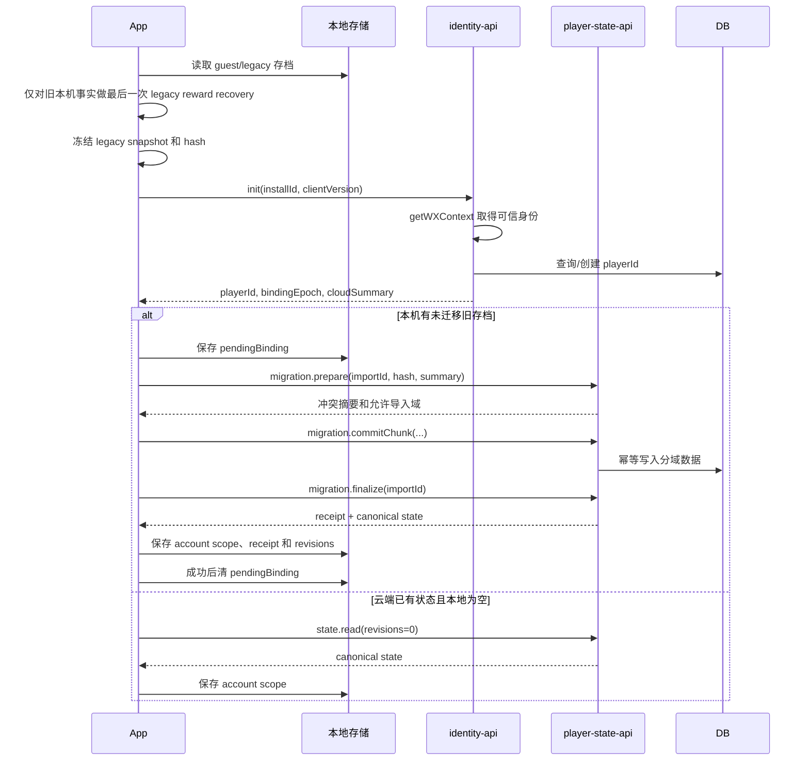

# Cleared 微信云开发接入分阶段执行方案与严格代码实施边界

> 文档状态：阶段 0/1 和阶段 2 已实施；阶段 3 已部署测试身份／只读函数，并通过开发者工具真实链路与关闭回退验证，双真实账号和真机／弱网验收待完成。第 21–22 节保留历史记录，当前状态见第 23 节与阶段 3 测试手册；不能据此宣称云存档上线。
> 客户端仓库：`godwhere/ClearedMiniProgram`  
> 审查基线：`main@69bcd6e4a0996149ef4b521d0d1764407bfc69cb`  
> 编写日期：2026-09-04  
> 官方资料查询日期：2026-09-04  
> 目标：在保留原生微信小游戏、本地优先启动和已有玩家资产的前提下，以微信云开发 CloudBase 代替尚未启用的自定义 HTTPS 后端，降低部署与维护成本。

本文是后续 Codex 实施的文件级合同。实现时必须按阶段执行；未经本文明确允许，不得扩大修改范围，也不得为了“先跑通云存档”而忽略已经与进度相关联的货币、领取标记、永久拥有权和体力。

---

## 0. 证据边界与文档优先级

### 0.1 本轮已核对的仓库事实

规划审查时 `main` 的最新提交为 `69bcd6e4a0996149ef4b521d0d1764407bfc69cb`。该提交只更新了 README；本方案所审查的运行时代码与其父提交保持一致。阶段 0/1 实施锁定的 HEAD 是 `f5d61d194a41a38846b3470e7546946a34ac104f`，差异与实际调用点见 [`cloudbase-phase-0-evidence.md`](cloudbase-phase-0-evidence.md)。

已经核对的关键路径和职责如下：

| 文件 | 当前职责 |
| --- | --- |
| `src/bootstrap.js` | 创建平台、各本地 Store、账号／同步／奖励／广告／分享服务并注入 `ClearedApp`；本地启动后异步执行 `resumeOnline()` |
| `src/platform/wechat.js` | 当前唯一 `wx.*` 边界，负责 Canvas、触摸、生命周期、存储、登录、HTTP、广告、分享、资料按钮、音频等 |
| `src/services/api-client.js` | 只支持自定义 HTTPS：相对 `/v1/` 路径、Bearer token、幂等 header、JSON 和统一错误 |
| `src/services/auth-service.js` | `platform.login()` 获取 code，再经 `/v1/auth/wechat` 换取业务 userId 和 accessToken |
| `src/services/session-store.js` | 保存 `userId/accessToken/issuedAt/expiresAt` |
| `src/services/sync-store.js` | 保存 installId、migrationId、boundUserId、revision、普通通关 outbox 和 ACK 元数据 |
| `src/services/progress-sync-service.js` | 首次 bootstrap、远端快照合并、增量 operation、一次安全重试、部分 ACK 和账号不匹配保护 |
| `src/services/progress-store.js` | 普通关卡 completed、bestMs、lastPlayed、当前主题／特效／音乐设置；云快照当前只导出 completed 和 bestMs |
| `src/services/daily-progress-store.js` | 每日日期记录、两小关完成、进入次数、entry 幂等键和服务端授权的额外次数 |
| `src/services/reward-unlock-service.js` | 本地余额、普通／每日领取标记、永久拥有权、广告 attempt 去重和待展示通知 |
| `src/services/reward-service.js` | 与上述本地奖励域不同，只处理服务端确认的每日额外进入资格 |
| `src/services/stamina-service.js` | 本地体力余额、自然恢复锚点、普通关卡永久解锁和快通返还记录 |
| `src/app.js` | 场景和业务流程编排；普通／每日结算、奖励恢复、购买入口、体力消费与返还、前后台恢复和在线恢复 |
| `tests/run.js` | 当前 Node 回归统一入口 |
| `tests/architecture-boundaries.test.js` | 保护 core、App、Renderer、平台和服务边界 |
| `scripts/check-package-budget.js` | 当前主包／分包源码字节预算检查 |

当前配置事实：

- `src/config/backend.js`：`enabled: false`、`baseUrl: ''`。
- `src/config/engagement.js`：账号、云同步、资料、分享归因、行为上报和服务端奖励开关均为关闭。
- `src/config/ads.js`：真实广告位为空，奖励广告相关开关关闭。
- `src/config/daily.js`：`debugUnlimitedEntries: true`，这是正式发布前必须阻断的开发开关。
- `src/config/rewards.js`：主线首通 `100`、每日完整首胜 `500`、两款货币主题各 `10000`。
- `src/config/stamina.js`：初始和自然恢复上限 `5`、每 `5` 分钟恢复 `1`、普通关卡首次永久解锁消耗 `1`、60 秒内首次符合条件可返还 `1`。

### 0.2 未直接读取的材料

用户提供的以下路径是本机绝对路径，不属于当前 GitHub 仓库，本方案不声称已经直接读取其正文：

```text
/Users/ethan/.codex/visualizations/2026/09/03/01a0678e-f943-7f03-89f3-9d67e22268b5/cloudbase-planning-2026-09-04/01-project-context.md
/Users/ethan/.codex/visualizations/2026/09/03/01a0678e-f943-7f03-89f3-9d67e22268b5/cloudbase-planning-2026-09-04/02-source-evidence.md
```

实施阶段 0 必须将这些材料与当前 `main` 对照；若其中的快照 SHA、文件内容或测试结果不同，以实施时明确锁定的 Git commit 为代码事实，并把差异写入阶段报告。

### 0.3 文档优先级

本方案只覆盖“CloudBase 接入和跨设备权威状态”。现有产品规则继续由以下文档决定：

- `docs/reward-unlock-system.md`：奖励数值、主题／特效解锁口径和本地现状。
- `docs/stamina-system.md`：体力产品规则。
- `docs/daily-challenge-mode.md`：每日两小关、进入次数和上海日期。
- `docs/hint-tiered-unlock-and-ad-fallback.md`：提示许可、分享和广告降级口径。
- `docs/user-account-sharing-ads-integration.md`：现有客户端账号／HTTP 框架事实。

发生冲突时：

1. 玩法、奖励数值、主题 ID、特效 ID、提示预览规则以各专题产品文档为准。
2. CloudBase 身份、数据权威、迁移、事务、部署和仓库边界以本文为准。
3. `docs/user-account-sharing-ads-integration.md` 中自定义 HTTPS、Bearer session、`code2Session` 和“只同步普通 completed/bestMs”的目标合同，在 CloudBase 路线启用后由本文取代。
4. 现有“后端独立仓库、当前客户端仓库禁止新增 `cloudfunctions/**`”约定继续保留。

---

## 1. 最终技术决策

### 1.1 推荐架构

```text
CanvasRenderer
      ↑ 只消费纯 ViewModel
ClearedApp
      ↓ 编排身份、同步、购买、反馈和本地落盘
现有领域服务
  ├─ ProgressStore / DailyProgressStore
  ├─ RewardUnlockService
  ├─ StaminaService
  ├─ RewardService
  └─ ProgressSyncService（历史名称保留，扩展为多域同步编排）
      ↓
ApiClient（保留统一请求、错误、幂等和重试语义）
      ↓
CloudFunctionTransport
      ↓ 只调用 WechatPlatform 的云能力
WechatPlatform
      ↓
wx.cloud.init / wx.cloud.callFunction
      ↓
CloudBase 普通云函数
  ├─ identity-api
  ├─ player-state-api
  └─ economy-api
      ↓
CloudBase 文档型数据库
```

### 1.2 推荐路线

首期采用：

- 微信小游戏原生 API：`wx.cloud.init`、`wx.cloud.callFunction`。
- CloudBase 普通事件云函数，而不是云托管／HTTP 云函数。
- CloudBase 文档型数据库。
- 服务端事务只在 Node 云函数中执行。
- 小游戏端不新增 CloudBase npm SDK，不执行“构建 npm”，避免包体和构建链变化。
- 云函数依赖与小游戏运行包彻底分离。
- 云端源码放独立私有仓库，推荐名称 `ClearedCloudBase`。

暂不采用：

- 云托管容器保留 REST API。
- 自定义业务 token。
- 小游戏客户端直接访问业务集合。
- PostgreSQL／MySQL。
- 在当前客户端仓库加入 `cloudfunctions/`。
- 将整个本地存档序列化成一个大 JSON 覆盖云端。

### 1.3 推荐理由

1. 当前项目只服务微信小游戏，使用原生云函数可直接获得平台注入的调用身份，不需要维护域名、证书、登录 code 交换、accessToken、刷新和会话表。
2. 当前项目无 npm 运行依赖。官方原生小游戏接入文档明确支持直接使用 `wx.cloud.init`，大部分云能力无需额外客户端 SDK。
3. 文档型数据库与当前按域拆分的本地 JSON 状态更匹配；通过确定性 `_id`、索引和服务端事务可以满足本项目幂等和并发要求。
4. 云托管／HTTP 路线虽然更接近现有 REST 合同，但会继续保留 HTTP 路由、身份交换和服务进程，维护成本更高。
5. 本项目的货币不可交易、奖励价值低，无需扩展为重型支付或交易系统；但仍必须使用服务器事务和幂等记录，避免多设备复制和重复消费。

### 1.4 官方资料基线

查询日期均为 2026-09-04：

- 原生微信小游戏 CloudBase 快速开始：  
  https://docs.cloudbase.net/quick-start/frameworks/wechat-minigame-native
- 小程序／小游戏原生调用普通云函数：  
  https://docs.cloudbase.net/cloud-function/how-use
- 微信端调用云函数及可信上下文示例：  
  https://docs.cloudbase.net/recipes/add-cloud-function-wechat-miniprogram
- `getWXContext` 与实例复用安全说明：  
  https://docs.cloudbase.net/cloud-function/instance
- 文档型数据库：  
  https://docs.cloudbase.net/database/introduce
- 服务端事务：  
  https://docs.cloudbase.net/database/transaction
- 数据库安全规则：  
  https://docs.cloudbase.net/database/security-rules
- 云函数基础配置和超时：  
  https://docs.cloudbase.net/cloud-function/function-configuration/config
- CloudBase CLI 部署云函数：  
  https://docs.cloudbase.net/cli-v1/functions/deploy
- 当前套餐和资源点说明：  
  https://cloud.tencent.com/document/product/876/136006
- 当前计算资源计量：  
  https://cloud.tencent.com/document/product/876/120342
- 告警通知：  
  https://cloud.tencent.com/document/product/876/39094
- 欠费／隔离／释放规则：  
  https://cloud.tencent.com/document/product/876/39729

官方资料会更新。每次进入部署阶段前，Codex 必须重新核对所用 SDK、运行时、计费和限制，不能只引用本文日期。

---

## 2. 当前真实流程审查

### 2.1 启动

当前 `src/bootstrap.js:start()`：

1. `new WechatPlatform()` 创建主 Canvas。
2. 同步读取普通进度、体力、每日、奖励、session 和 sync 元数据。
3. 创建 ApiClient、AuthService、ProgressSyncService、RewardService、ShareService 等。
4. 创建 `ClearedApp`，构造期间：
   - 用已完成和 lastPlayed 恢复体力永久关卡解锁；
   - 尝试恢复快通返还；
   - `recoverRewardUnlocks()` 根据已保存普通／每日完成事实修复本地余额和拥有权；
   - 再创建受拥有权保护的主题和特效服务。
5. `app.start()` 先进入本地游戏循环。
6. 分享监听和入口参数在本地安装。
7. 异步执行 `app.resumeOnline()` 和行为上报。

正确边界：第一帧、离线游戏和本地存档不依赖后端。

CloudBase 接入后必须保持相同顺序：本地启动完成后才初始化云能力；云初始化失败只影响账号状态，不影响玩法。

### 2.2 当前身份和会话

当前链路：

```text
AuthService.ensureSession()
  → SessionStore.current()
  → WechatPlatform.login()
  → ApiClient POST /v1/auth/wechat
  → 保存 userId + accessToken
```

CloudBase 启用后：

```text
AuthService.ensureSession()
  → WechatPlatform.initCloud()
  → ApiClient / CloudFunctionTransport 调 identity-api:init
  → 云函数从 getWXContext() 获取可信 OPENID/APPID
  → 云端返回内部 playerId + bindingEpoch
  → SessionStore 保存 cloud session 元数据
```

CloudBase 模式不再调用 `wx.login()`，也不再保存 accessToken。旧 HTTP 模式在迁移兼容期保留但默认关闭。

### 2.3 普通通关

当前 `ClearedApp.onPathCompleted()` 在普通成功后大致执行：

```text
completionPolicies.settle()
  → ProgressStore.recordCompletion()
  → 体力快通返还
  → 再次确认 ProgressStore.save()
  → recoverRewardUnlocks()
  → ProgressSyncService.enqueueCompletion()
  → EngagementService.onOrdinaryCompleted()
```

风险：

- `ProgressStore.recordCompletion()` 已经修改内存并自行调用保存，App 又确认一次保存结果。
- `recoverRewardUnlocks()` 根据全部已保存 completed 补齐普通领取记录和余额。
- 云端 completed 写回本地后若继续执行相同恢复流程，会把远端完成误当成本机未领取完成，再次增加本地余额。
- 体力快通返还也会根据 completed/bestMs 在启动和前台恢复时补做，需要与云端返还记录同时迁移。

改造要求：

- 普通通关先保留本地落盘和即时结果。
- 生成一个稳定 `MAIN_LEVEL_COMPLETED` operation。
- 云端在同一事务内处理完成、最佳时间、首次奖励和必要的关卡条件 entitlement。
- 客户端应用服务器回执后更新确认余额和拥有权。
- 云端状态合并不得调用“可增加本地余额”的 legacy reconcile。

### 2.4 每日完成

当前：

- `DailyProgressStore.recordEntry()` 在每次开始完整每日轮次时记录进入次数和幂等键。
- `recordLevelCompletion()` 逐小关保存；两关全部完成后产生 `dayFirstClear/rewardEligible`。
- `ClearedApp.completeDailyLevel()` 在最终小关完成后调用 `recoverRewardUnlocks()`，本地按日期发 `500`。
- `RewardService` 仅处理服务端每日额外进入次数，不管理本地 500 货币。

CloudBase 后：

- 每日进入、两小关完成和奖励资格使用上海 `dateKey`。
- `DAILY_ENTRY_USED`、`DAILY_LEVEL_COMPLETED` 是独立幂等操作。
- 第二小关使整日首次完成时，云端在同一事务中写 `daily reward claim +500`。
- `RewardService` 继续是额外次数域，不能与钱包混成一个服务。

### 2.5 购买和永久拥有权

当前货币主题购买是本地事务：

```text
RewardUnlockService.purchase(rewardId)
  → 校验本地 balance
  → balance -= 10000
  → ownedRewards[rewardId] = true
  → 一次本地写盘
```

单设备内是原子的，多设备间不是。只同步通关而不同步钱包／拥有权时会发生：

- 设备 A 购买，设备 B 仍看到旧余额。
- 两设备分别花同一笔钱。
- 重装后购买资产丢失。
- 云端完成记录写回后再次补发奖励，已消费货币重新出现。

正式 R1 必须把购买改成在线服务器事务；已拥有资产可以离线使用。

### 2.6 体力

当前 `StaminaService` 保存：

```js
{
  schemaVersion: 1,
  balance,
  nextRecoveryAt,
  unlockedLevels,
  refundedLevels
}
```

其中：

- `5` 是自然恢复上限，不是硬最大值。
- 普通关卡首次永久解锁和扣 1 在同一写盘。
- 快通返还按 levelKey 去重。
- App 构造和 `onShow()` 会根据 progress 恢复解锁／返还。

只同步普通进度会让每台设备各自获得一套 5 点自然恢复和返还记录。正式 R1 必须同步体力物化状态、永久关卡解锁和返还键。

### 2.7 前后台恢复和账号竞态

当前 `onHide()`：

- 结算体力；
- 保存普通进度；
- 尝试同步；
- 尝试行为上报。

当前 `onShow()`：

- 恢复体力返还和自然恢复；
- 再次调用 `recoverRewardUnlocks()`；
- 处理分享入口；
- 恢复 Runner、音频和循环；
- 异步 `resumeOnline()`。

CloudBase 接入时必须增加账号代次 guard。任何网络、广告、分享和资料回调都捕获：

```js
{
  ownerIdAtStart,
  bindingEpochAtStart,
  appGenerationAtStart,
  operationId
}
```

回调到达时不匹配当前账号即不得写入当前账号状态。

---

## 3. 正式首期范围

### 3.1 最小但完整的 R1

正式 R1 是阶段 0—5 的整体，不允许只上线进度域。必须包含：

1. CloudBase 可信身份和内部 playerId。
2. 本地 guest／账号命名空间和账号切换保护。
3. 普通完成、最佳时间、最后游玩位置。
4. 每日两小关、进入次数和上海日期。
5. 货币余额、普通／每日领取键、不可变流水。
6. 购买回执和永久拥有权。
7. 体力余额、恢复锚点、永久关卡解锁和快通返还。
8. 当前主题、当前特效和音乐设置。
9. 首次旧存档迁移和多设备重试。
10. operation outbox、部分 ACK、分域 revision、存储失败处理。
11. 灰度开关、监控、备份和回滚。

可以后置：

- 头像昵称。
- 分享归因。
- 真实广告位。
- 行为事件上传。
- 好友助力。
- 提示免费／分享／广告次数跨设备。
- 待展示通知同步。
- 素材下载状态同步。

### 3.2 禁止把“只同步 completed/bestMs”作为正式版本

它最多可用于仅测试账号的 read-only 或 shadow 阶段，并且必须同时满足：

- 禁止云进度触发本地奖励恢复。
- 禁止云端购买。
- 禁止资产迁移。
- 不面向正式玩家。
- 不宣称完成云存档上线。

---

## 4. 数据权威与合并合同

### 4.1 数据矩阵

| 数据 | 当前来源 | R1 同步 | 迁移后权威 | 合并／结算规则 | 离线行为 |
| --- | --- | ---: | --- | --- | --- |
| 普通关卡完成 | ProgressStore | 是 | 云端，客户端缓存 | true 单调并集；不得被 false 清除 | 本地保存并入队 |
| 最佳时间 | ProgressStore | 是 | 云端 | 两边合法正数取更小 | 本地暂存并入队 |
| 最后游玩位置 | ProgressStore | 是 | 云端轻量偏好 | 每字段按服务器提交序列 LWW | 本地立即更新 |
| 每日 dateKey/dayId | DailyProgressStore | 是 | 云端 | 按上海日期独立记录；dayId 不匹配拒绝 | 使用上海日期和服务器时差锚点 |
| 每日两小关完成 | DailyProgressStore | 是 | 云端 | 小关完成集合并集 | 本地保存并入队 |
| 每日进入次数 | DailyProgressStore | 是 | 云端幂等事件计数 | 不合并快照数字；按 entry operation 结算 | 本地先消费并入队 |
| 每日额外资格 | RewardService | 是，功能可关闭 | 云端 | grantId 幂等、entryLimit 单调增加 | 无授权回执不增加 |
| 货币余额 | RewardUnlockService | 是 | 云端钱包流水物化 | 不取最大、不相加、不从完成数重算 | 可显示 pendingCredit，购买只用 confirmedBalance |
| 普通领取标记 | RewardUnlockService | 是 | 云端 | `ordinary:first-clear:<levelKey>` 唯一 | 离线通关形成待确认奖励 |
| 每日领取标记 | RewardUnlockService | 是 | 云端 | `daily:first-complete:<dateKey>` 唯一 | 离线完整完成形成待确认奖励 |
| 购买记录 | RewardUnlockService | 是 | 云端 | operationId 幂等，价格由服务端目录决定 | R1 禁止离线购买 |
| 永久拥有权 | RewardUnlockService | 是 | 云端 | entitlement 集合单调增加；迁移资产注明来源 | 已确认拥有可离线使用 |
| 广告 attempt 记录 | RewardUnlockService | R1 不作为平台验证 | 本地；功能上线后云端策略 | 客户端 `isEnded` 仍只是客户端回调证据 | 沿现有产品口径 |
| 体力余额 | StaminaService | 是 | 云端物化，客户端缓存 | 通过消费／返还事件和服务器恢复时间结算 | 本地乐观消费并入队 |
| 体力恢复时间 | StaminaService | 是 | 云端服务器时间 | `balance >= 5` 无恢复；低于 5 按锚点结算 | 用最后服务器时差估算 |
| 永久关卡解锁 | StaminaService | 是 | 云端 | 每 levelKey 只扣一次 | 已确认解锁离线可用 |
| 快通返还 | StaminaService | 是 | 云端 | 每 levelKey／规则版本只返一次 | 本地乐观返还并入队 |
| 当前主题 | ProgressStore.settings | 是 | 云端偏好 | LWW，应用前校验拥有权 | 本地立即切换 |
| 当前特效 | ProgressStore.settings | 是 | 云端偏好 | LWW，应用前校验拥有权 | 本地立即切换 |
| 音乐设置 | ProgressStore.settings | 是 | 云端偏好 | LWW | 本地立即生效 |
| 当日提示许可 | HintAccessService | 否，R2 | 本地 | 当前产品仍为设备级许可 | 沿现状 |
| 头像昵称 | ProfileService | 否，R2 | 云端资料 | 只在用户主动授权后更新 | 未授权不影响游戏 |
| 业务 session | SessionStore | 退役 | 不属于普通存档 | legacy 只读，Cloud 模式不签 token | 无 |
| 同步元数据 | SyncStore | 是 | 云端 revision、本地 outbox | 按 player scope 隔离 | 本地持久化 |
| 待处理操作 | SyncStore | 不作为存档快照上传 | 本地；云端存 receipt | 只删除明确 ACK 且本地结果已落盘的操作 | 保留重试 |
| 待展示通知 | RewardUnlockService | 否 | 本地设备 | 不影响资产本体 | 本地 |
| 素材下载状态 | SubpackageService／运行时 | 否 | 本地设备 | 与拥有权、当前应用完全分开 | 按需重下 |

### 4.2 不允许的合并

```text
cloud.balance = max(localA.balance, localB.balance)
cloud.balance = localA.balance + localB.balance
cloud.stamina = max(localA.stamina, localB.stamina)
cloudSave = lastWholeJsonWins
owned = currentSelectedAppearance
owned = downloadedAsset
```

### 4.3 推荐域 revision

```js
{
  progressRevision,
  dailyRevision,
  economyRevision,
  entitlementRevision,
  staminaRevision,
  preferenceRevision
}
```

不使用一个全局 revision 阻塞所有域。购买冲突不应导致普通最佳时间无法同步。

---

## 5. 身份、绑定和本地命名空间

### 5.1 可信身份

普通云函数必须：

```js
const cloud = require('wx-server-sdk');
const wxContext = cloud.getWXContext();
const openId = wxContext.OPENID;
const appId = wxContext.APPID;
```

授权原则：

- 数据归属只由云函数运行时注入的身份决定。
- 客户端提交的 `userId/openid/playerId` 不得参与授权查询。
- 客户端提交的 `claimedPlayerId/bindingEpoch` 只用于检测迟到回调和账号错位。
- `UNIONID` 可能为空，不作为 R1 主键。
- 身份函数只允许小游戏原生云调用，不开放为公共 HTTP 函数，避免混合来源和实例复用风险。
- 原始 openId 不返回客户端，不记录在业务日志。

云端生成内部 `playerId`，除身份映射集合外，其余业务集合只使用 `playerId`。

### 5.2 SessionStore v2

目标结构：

```js
{
  schemaVersion: 2,
  installId: 'ins_xxx',
  mode: 'guest' | 'legacy-http' | 'cloud',
  ownerId: 'guest:ins_xxx' | 'player_xxx',
  bindingEpoch: 0,
  environmentId: '',
  migrationState: 'none' | 'prepared' | 'uploading' | 'complete' | 'blocked',
  migrationImportId: null,
  migrationReceiptId: null,
  establishedAt: 0,

  // 迁移期兼容，禁止上传到普通云存档
  legacySession: null
}
```

兼容要求：

- 可读取当前 schemaVersion 1。
- 不因 schema 升级删除旧 token；先放到 `legacySession`，只有明确完成 CloudBase 切换后再清理。
- cloud mode 不保存 accessToken。
- `ownerId` 是客户端命名空间键，不是服务器授权凭证。
- 写盘失败时不能宣布身份或迁移完成。

### 5.3 SyncStore v2

目标结构：

```js
{
  schemaVersion: 2,
  installId: 'ins_xxx',
  nextOperationSequence: 42,
  activeOwnerId: 'guest:ins_xxx',
  scopes: {
    'guest:ins_xxx': {
      bindingEpoch: 0,
      revisions: {
        progress: 0,
        daily: 0,
        economy: 0,
        entitlements: 0,
        stamina: 0,
        preferences: 0
      },
      pendingOperations: [],
      snapshotRequired: false,
      lastSyncAt: 0,
      lastError: null
    }
  }
}
```

规则：

- operation sequence 是整个安装级单调序列，必须先持久化再返回 ID。
- pending operation 必须带 `ownerIdAtCreation` 和 `bindingEpochAtCreation`。
- guest 队列不得自动移动到任意微信账号；首次绑定迁移需要明确 import。
- 账号 A 的 operation 永远不能由账号 B 发送。
- v1 中已有 `boundUserId` 时，迁移为对应 legacy scope；未知／损坏绑定进入 `blocked`，不得自动清空。
- 每 scope 上限维持 200；溢出设置 `snapshotRequired`，但经济和体力 operation 不得静默丢弃。
- 经济／购买 operation 达到上限时禁止新的经济动作并提示同步，而不是覆盖旧操作。

### 5.4 首次绑定流程



本地归属写入顺序：

1. 保留原 guest／legacy 存档。
2. 写 `pendingBinding`。
3. 使用稳定 importId 发起云端迁移。
4. 云端成功后返回 receipt。
5. 客户端把账号缓存、receipt、bindingEpoch 和 revisions 一次日志式提交到本地。
6. 第 5 步成功后才切换 activeOwnerId 并清除 pending。
7. 旧存档至少保留一个正式版本周期，且不再成为经济权威。

### 5.5 完整场景

| 场景 | 行为 |
| --- | --- |
| 首次绑定，云端为空 | 用户确认后把一份主旧存档作为该账号资产基线 |
| 新设备，本地为空 | 拉取同一 playerId 的云端状态 |
| 新设备有游客进度，云端已有账号状态 | 进度可合并；余额不得自动叠加；进入迁移确认 |
| 重装 | 新 installId，同一微信身份得到同一 playerId，直接恢复云端 |
| 两设备各有离线完成 | completed 并集，bestMs 取最小，奖励 claim 全局去重 |
| 同设备切换微信账号 | 切换本地 account scope；保留原账号存档和 outbox |
| 云端成功但客户端超时 | 相同 operationId/importId 重试，服务器返回原 receipt |
| 云端读取成功但本地保存失败 | 不推进 revision、不删除 operation，进入 storage-blocked |
| 同一历史数据重复导入 | importId + snapshotHash + receipt 返回 alreadyApplied |
| 不同设备重复导入同一历史 | 只允许一份 economy baseline；其他设备只能补进度／可验证权益 |
| 旧客户端与新客户端并存 | 旧版继续本地；升级后只能补充进度，不能再次导入余额或购买资产 |

### 5.6 迟到响应和广告回调

所有异步任务捕获：

```js
{
  ownerIdAtStart,
  bindingEpochAtStart,
  appGenerationAtStart,
  operationId
}
```

应用前必须检查：

```js
if (
  token.ownerIdAtStart !== session.ownerId ||
  token.bindingEpochAtStart !== session.bindingEpoch ||
  token.appGenerationAtStart !== app.accountGeneration
) {
  return { ok: false, reason: 'stale-account-context' };
}
```

广告在账号 A 开始，即使回调到达时已切到账号 B，也只能进入 A 的 pending scope；不能给 B 发奖。

---

## 6. 旧资产迁移政策

### 6.1 已知限制

当前本地钱包没有完整历史收支流水。仅凭：

- 完成记录；
- 当前余额；
- claimedOrdinary；
- claimedDaily；
- ownedRewards；

不能可靠恢复每一笔历史收入和消费。因此：

- 不能按关卡数重新计算余额；
- 不能把多个设备余额相加；
- 不能取最大值假装无损合并；
- 不能假定所有拥有权都来自可验证购买或广告。

### 6.2 推荐政策：`LEGACY_PRIMARY_SNAPSHOT_V1`

每个 CloudBase playerId 只能接受一份“主旧存档”作为经济基线：

1. 本地主余额生成一笔：
   - `reason = MIGRATION_OPENING_BALANCE`
   - `delta = legacyBalance`
   - `sourceImportId = importId`
2. 已拥有资产分类导入：
   - `DERIVED_FROM_PROGRESS`：能由指定关卡完成验证；
   - `LEGACY_PURCHASE_ASSERTED`：本地记录为已购买，但没有完整流水；
   - `LEGACY_AD_ASSERTED`；
   - `LEGACY_SHARE_ASSERTED`。
3. 迁移前已经完成的普通关卡和每日日期写入 reward claim 或 `SETTLED_BY_MIGRATION` 标记，防止随后再发 100／500。
4. 其他设备后续只能补：
   - 未见过的完成；
   - 更短 bestMs；
   - 可由进度验证的 entitlement；
   - 用户明确允许接纳的旧 entitlement；
   - 不得增加 economy opening balance。
5. 迁移 receipt 永久记录 policyVersion、snapshotHash 和导入摘要。

### 6.3 `recoverRewardUnlocks/reconcile` 顺序

禁止：

```text
拉取云端 completed
→ mergeCloudSnapshot
→ recoverRewardUnlocks
→ 本地再加 100/500
```

必须：

```text
1. 只读取旧本机完成事实
2. 在任何云端进度合并前执行最后一次 legacy recovery
3. 冻结 reward state + progress + daily + stamina
4. 创建 migration snapshot
5. 云端完成迁移和 reward settled 标记
6. 本地切换为 cloud-authoritative
7. 以后云端状态应用只更新确认余额、claim 和 entitlement
8. 不再从 completed 自动增加权威余额
```

建议新增显式方法，而不是继续用含糊布尔参数：

```js
recoverLegacyRewardsBeforeMigration()
applyAuthoritativeEconomySnapshot(snapshot)
applyAuthoritativeRewardReceipt(receipt)
auditProgressDerivedEntitlements()
```

原 `reconcile()`：

- 仅在 `mode === 'legacy-local'` 时允许产生 amountDelta。
- `migrationState === 'complete'` 后调用必须返回 `cloud-authoritative`，不得修改余额。

### 6.4 离线奖励

允许离线通关。客户端显示：

```js
{
  confirmedBalance: 12000,
  pendingCredit: 100,
  displayBalance: 12100
}
```

约束：

- pendingCredit 只来自本地已持久化 operation。
- 购买只允许使用 confirmedBalance，且必须先完成在线同步。
- 云端若判断奖励已领取，移除 pendingCredit，保持通关。
- 结果页可显示“奖励待同步”，不能声称已经云端到账。

### 6.5 离线购买

R1 推荐禁止：

```text
已拥有资产：离线可使用
购买新永久资产：必须联网
```

若未来要求离线购买，需要单独设计服务器预留额度、设备绑定、过期回收和冲突处理，不属于本方案首期。

---

## 7. 云端数据模型

R1 采用 CloudBase 文档型数据库。禁止一个玩家一个大 JSON 文档覆盖全部域。

### 7.1 集合

| 集合 | 文档主键 | 核心字段 |
| --- | --- | --- |
| `identity_subjects` | `sha256(appId + ':' + openId)` | `playerId`, `appId`, `createdAt`, `lastSeenAt` |
| `players` | `playerId` | `schemaVersion`, `bindingEpoch`, `migrationState`, 各域 revision |
| `device_bindings` | `sha256(playerId + ':' + installId)` | `playerId`, `installId`, `firstSeenAt`, `lastSeenAt`, `status` |
| `progress_levels` | `sha256(playerId + ':progress:' + levelKey)` | `completed`, `bestMs`, `rewardStatus`, `updatedAt` |
| `player_resume` | `playerId` | `lastLevelKey`, `serverSequence`, `updatedAt` |
| `daily_records` | `sha256(playerId + ':daily:' + dateKey)` | `dateKey`, `dayId`, `completedLevelIds`, `entriesUsed`, `entryKeys`, `rewardStatus` |
| `wallets` | `playerId` | `balance`, `economyRevision`, `updatedAt` |
| `wallet_ledger` | `sha256(playerId + ':wallet:' + idempotencyKey)` | `delta`, `reason`, `refId`, `balanceAfter`, `createdAt` |
| `reward_claims` | `sha256(playerId + ':reward:' + rewardKey)` | `rewardKey`, `amount`, `sourceOperationId`, `createdAt` |
| `entitlements` | `sha256(playerId + ':entitlement:' + kind + ':' + itemId)` | `kind`, `itemId`, `grantType`, `sourceRef`, `legacyAsserted` |
| `purchase_receipts` | `sha256(playerId + ':purchase:' + operationId)` | `itemId`, `price`, `balanceAfter`, `status` |
| `stamina_states` | `playerId` | `balance`, `naturalCap`, `nextRecoveryAt`, `staminaRevision` |
| `stamina_ledger` | `sha256(playerId + ':stamina:' + operationId)` | `delta`, `reason`, `levelKey`, `createdAt` |
| `stamina_unlocks` | `sha256(playerId + ':stamina-unlock:' + levelKey)` | `levelKey`, `spent`, `sourceOperationId` |
| `stamina_refunds` | `sha256(playerId + ':stamina-refund:' + levelKey + ':v1')` | `levelKey`, `amount`, `sourceOperationId` |
| `player_preferences` | `playerId` | `skinId`, `clearEffectId`, `soundEnabled`, 每字段 serverSequence |
| `migration_imports` | `sha256(playerId + ':migration:' + importId)` | `policyVersion`, `snapshotHash`, `chunks`, `status`, `receipt` |
| `operation_receipts` | `sha256(playerId + ':operation:' + operationId)` | `payloadHash`, `status`, `resultCode`, `resultSummary`, `createdAt` |

### 7.2 索引

除 `_id` 唯一性外，至少建立：

```text
identity_subjects(playerId)
device_bindings(playerId, lastSeenAt)
progress_levels(playerId, updatedAt)
daily_records(playerId, dateKey)
wallet_ledger(playerId, createdAt)
reward_claims(playerId, createdAt)
entitlements(playerId, kind)
purchase_receipts(playerId, createdAt)
stamina_ledger(playerId, createdAt)
operation_receipts(playerId, createdAt)
migration_imports(playerId, status)
```

### 7.3 schemaVersion

- 每个集合文档都有 `schemaVersion`。
- 业务请求有 `protocolVersion`。
- 奖励／价格目录有 `catalogVersion`。
- 迁移有 `policyVersion`。
- 服务端必须拒绝高于自己支持范围的 protocolVersion。
- 旧 schema 升级使用显式 migration，不在读请求中默默重写大量历史文档。

### 7.4 事务边界

#### 普通首通

同一事务：

1. 检查 operation receipt。
2. 读取／更新 `progress_levels`。
3. 若全账号首次完成，创建 reward claim。
4. 创建 `wallet_ledger(+100)`。
5. 更新 wallet。
6. 授予关卡条件 entitlement。
7. 保存 operation receipt。
8. 推进相关 revision。

#### 每日首次完整完成

同一事务：

1. 检查 operation receipt。
2. 更新 dateKey 对应 daily record。
3. 判断两个固定小关均完成。
4. 创建 `daily:first-complete:<dateKey>` claim。
5. 创建 `wallet_ledger(+500)`。
6. 更新 wallet。
7. 保存 receipt 和 revision。

#### 购买

同一事务：

1. 检查 operation receipt／purchase receipt。
2. 从服务端 catalog 读取 item 与价格。
3. 校验未拥有。
4. 校验余额。
5. 创建 `wallet_ledger(-10000)`。
6. 更新 wallet。
7. 创建 entitlement。
8. 创建 purchase receipt。
9. 保存 operation receipt。
10. 推进 economy／entitlement revision。

#### 体力首次解锁

同一事务：

1. 按服务器时间结算自然恢复。
2. 检查 level unlock 是否存在。
3. 若不存在，校验／结算体力。
4. 创建 stamina ledger 和 unlock。
5. 更新 stamina state。
6. 保存 operation receipt。

#### 快通返还

同一事务：

1. 检查返还键。
2. 校验该 level 已解锁且 completion operation 合法。
3. 创建 stamina refund 和 ledger。
4. 更新 stamina state。
5. 保存 receipt。

事务内禁止：

- 外部 HTTP。
- 广告调用。
- 分享调用。
- 遍历整个玩家历史。
- 写完整大快照。
- 打印完整业务数据。

内部工程限制：

- 单事务尽量不超过 8 个核心文档。
- 冲突自动重试最多 3 次，指数退避。
- 同一事务按固定顺序读取 wallet／claim／entitlement，降低冲突。
- `DATABASE_TRANSACTION_CONFLICT` 不直接映射成用户失败，先安全重试。
- 迁移不使用一个超大事务，而使用可恢复的 chunk + finalize 状态机。

---

## 8. 云函数与接口合同

### 8.1 函数划分

| 函数 | action | 职责 |
| --- | --- | --- |
| `identity-api` | `identity.init`, `identity.status` | 可信身份映射、playerId、bindingEpoch、环境和最低协议 |
| `player-state-api` | `state.read`, `migration.prepare`, `migration.commitChunk`, `migration.finalize`, `sync.push` | 进度、每日、体力、偏好、迁移和批量操作 |
| `economy-api` | `economy.read`, `economy.purchase` | 钱包、领取、拥有权和购买事务 |

三个函数均为普通云函数，非公共 HTTP 函数。未来管理后台使用独立 admin 函数／服务，不能复用依赖 `getWXContext()` 的玩家函数。

### 8.2 通用请求

```json
{
  "protocolVersion": 1,
  "clientVersion": "1.0.0",
  "requestId": "req_xxx",
  "operationId": "op_xxx",
  "idempotencyKey": "purchase:op_xxx",
  "installId": "ins_xxx",
  "claimedPlayerId": "player_xxx",
  "bindingEpoch": 3,
  "expectedRevisions": {
    "progress": 12,
    "daily": 3,
    "economy": 8,
    "entitlements": 5,
    "stamina": 4,
    "preferences": 2
  },
  "action": "sync.push",
  "payload": {}
}
```

服务端：

- 从可信上下文确定 player。
- `claimedPlayerId` 不匹配时返回 `ACCOUNT_BINDING_MISMATCH`。
- operationId 重复且 payloadHash 相同，返回原 receipt。
- operationId 重复但 payloadHash 不同，返回 `IDEMPOTENCY_PAYLOAD_MISMATCH`。

### 8.3 通用响应

```json
{
  "ok": true,
  "code": "OK",
  "requestId": "req_xxx",
  "operationId": "op_xxx",
  "serverTimeMs": 1788508800000,
  "serverDateKey": "2026-09-04",
  "player": {
    "playerId": "player_xxx",
    "bindingEpoch": 3
  },
  "revisions": {
    "progress": 13,
    "daily": 3,
    "economy": 9,
    "entitlements": 6,
    "stamina": 5,
    "preferences": 2
  },
  "retryable": false,
  "data": {}
}
```

### 8.4 `identity.init`

请求：

```json
{
  "action": "identity.init",
  "protocolVersion": 1,
  "clientVersion": "1.0.0",
  "requestId": "req_identity_1",
  "installId": "ins_xxx",
  "localBinding": {
    "claimedPlayerId": null,
    "bindingEpoch": 0
  }
}
```

响应：

```json
{
  "ok": true,
  "code": "OK",
  "serverTimeMs": 1788508800000,
  "serverDateKey": "2026-09-04",
  "player": {
    "playerId": "player_xxx",
    "bindingEpoch": 1,
    "hasCloudState": true,
    "migrationState": "COMPLETE"
  },
  "minimumClientVersion": "1.0.0",
  "protocolVersion": 1
}
```

### 8.5 `state.read`

请求：

```json
{
  "action": "state.read",
  "knownRevisions": {
    "progress": 12,
    "daily": 3,
    "stamina": 4,
    "preferences": 2
  }
}
```

只返回变化域；不得返回 session 或整份本地存档。

### 8.6 `migration.prepare`

```json
{
  "action": "migration.prepare",
  "importId": "mig_ins_xxx_hash_v1",
  "policyVersion": "LEGACY_PRIMARY_SNAPSHOT_V1",
  "snapshotHash": "sha256:...",
  "summary": {
    "completedCount": 38,
    "dailyCount": 6,
    "balance": 12400,
    "entitlementCount": 4,
    "staminaBalance": 3
  }
}
```

返回冲突摘要，不立即更改资产：

```json
{
  "ok": false,
  "code": "MIGRATION_CONFIRMATION_REQUIRED",
  "data": {
    "cloudHasState": true,
    "economyBaselineExists": false,
    "allowedDomains": [
      "progress",
      "daily",
      "economyBaseline",
      "entitlements",
      "stamina",
      "preferences"
    ],
    "conflicts": []
  }
}
```

### 8.7 `migration.commitChunk/finalize`

分块建议：

```text
progress
daily
economy-baseline
entitlements
stamina
preferences
```

每个 chunk：

- `chunkId` 稳定。
- 带 payloadHash。
- 最多 50—100 条小记录。
- 可重复。
- 已完成返回同一 receipt。
- finalize 前 migrationState 不得变 complete。

### 8.8 `sync.push`

```json
{
  "action": "sync.push",
  "operations": [
    {
      "operationId": "op_clear_001",
      "ownerIdAtCreation": "player_xxx",
      "bindingEpochAtCreation": 3,
      "domain": "progress",
      "type": "MAIN_LEVEL_COMPLETED",
      "baseRevision": 12,
      "occurredAtClientMs": 1788508700000,
      "payload": {
        "levelKey": "0:0",
        "elapsedMs": 48320
      }
    }
  ]
}
```

部分 ACK：

```json
{
  "ok": true,
  "code": "OK",
  "data": {
    "results": [
      {
        "operationId": "op_clear_001",
        "status": "ACKED",
        "code": "OK",
        "receipts": {
          "progress": {
            "completed": true,
            "bestMs": 48320
          },
          "reward": {
            "rewardKey": "ordinary:first-clear:0:0",
            "delta": 100,
            "balanceAfter": 12500
          }
        }
      }
    ]
  }
}
```

客户端处理顺序：

```text
校验账号代次
→ 应用权威回执到各现有 Store
→ 本地保存全部受影响状态
→ 保存新 revisions
→ 删除已 ACK operation
```

任一步本地保存失败：

- operation 保留；
- revision 不推进；
- 下次同 operationId 重试；
- 服务器返回原 receipt。

### 8.9 `economy.purchase`

```json
{
  "action": "economy.purchase",
  "operationId": "op_purchase_001",
  "idempotencyKey": "purchase:op_purchase_001",
  "expectedEconomyRevision": 9,
  "payload": {
    "kind": "theme",
    "itemId": "desserts",
    "catalogVersion": 1
  }
}
```

客户端不能提交价格。服务端目录必须与 `src/config/rewards.js` 的 ID 和数值同步，并通过测试防止漂移。

### 8.10 错误码

| code | retryable | 客户端处理 |
| --- | ---: | --- |
| `CLOUD_NOT_CONFIGURED` | 否 | 使用纯本地模式 |
| `AUTH_CONTEXT_MISSING` | 否 | 重新初始化云环境 |
| `PROTOCOL_UNSUPPORTED` | 否 | 提示升级，不继续写 |
| `ACCOUNT_BINDING_MISMATCH` | 否 | 停止当前 scope 同步 |
| `MIGRATION_IN_PROGRESS` | 是 | 查询状态后继续 |
| `MIGRATION_BASELINE_EXISTS` | 否 | 禁止第二份余额导入 |
| `MIGRATION_CONFIRMATION_REQUIRED` | 否 | 展示明确确认 |
| `REVISION_CONFLICT` | 否 | 先 state.read，再重放可交换操作 |
| `IDEMPOTENCY_PAYLOAD_MISMATCH` | 否 | 隔离 operation，记录严重错误 |
| `VALIDATION_FAILED` | 否 | 进入 dead-letter，不无限重试 |
| `INSUFFICIENT_BALANCE` | 否 | 应用服务器余额并提示 |
| `ALREADY_OWNED` | 否 | 视为拥有成功，不再扣费 |
| `RATE_LIMITED` | 是 | 按 retryAfterMs 退避 |
| `TRANSACTION_CONFLICT` | 是 | 服务端先重试，仍失败再返回 |
| `STORE_TEMPORARY` | 是 | 相同 operationId 重试 |
| `INTERNAL` | 条件重试 | 指数退避 |
| `LOCAL_PERSIST_FAILED` | 本地 | 不 ACK，暂停资产写操作 |

重试：

- operationId／idempotencyKey 不变。
- requestId 每次传输可变化。
- 退避：1s、2s、4s、8s、30s 封顶并加抖动。
- onShow 去抖，不能短时间多次启动相同 full sync。
- 后台不持续轮询。

---

## 9. 体力专项一致性

### 9.1 服务器物化

服务器在每个体力事务开始时：

```text
若 balance >= 5:
  nextRecoveryAt = null
否则:
  按 serverNow 与 nextRecoveryAt 结算完整 5 分钟 tick
  最多恢复到 5
```

不得执行：

```js
balance = Math.min(balance, 5);
```

因为未来好友助力可使余额大于 5。

### 9.2 离线首次解锁

推荐休闲游戏政策：

- 本地有可用体力时允许离线首次解锁。
- 本地把扣费和永久 level unlock 同一写盘，并创建 operation。
- 云端收到后：
  - 未解锁且余额足够：正常扣费；
  - 已解锁：不重复扣费，返回权威状态；
  - 因另一设备消费导致余额不足：保留该离线产生的关卡解锁和进度，云端余额收敛到 0，记录 `OFFLINE_STAMINA_CONFLICT_ACCEPTED`，不重复发首通货币。
- 不撤销已完成关卡，不把体力变成负数。

这是体验优先的低价值资源政策，不是严格反作弊。若冲突率异常，再单独升级为在线首次解锁或设备配额。

### 9.3 快通返还

当前规则按 levelKey 一次性返还。云端唯一键：

```text
stamina-refund:<levelKey>:rule-v1
```

- elapsedMs 仍来自客户端，不能宣称防作弊。
- 首期只做范围和关卡合法性校验。
- 重复设备／重试只返一次。
- 云端回执写入本地 `refundedLevels` 后，旧 `recoverStaminaRefunds()` 不得再次本地加余额。

---

## 10. 广告、分享、资料和行为上报

CloudBase 接入不自动开启这些能力。

### 10.1 广告

- 真实 adUnitId 仍需平台资格和后台配置。
- `AdsService` 的 `isEnded === true` 只代表客户端 SDK 的发奖回调条件。
- 未接平台服务端验证前，云端记录名称必须是 `CLIENT_CALLBACK_ACCEPTED`，不得命名 `SERVER_VERIFIED_AD`。
- 账号 A 开始的 attempt 固定属于 A。
- R1 可保持奖励广告关闭。

### 10.2 分享

- `shareAppMessage` 发起成功不是好友真实收到或打开。
- `onShow` 返回不是分享成功。
- 当前本地“发起分享后解锁提示／主题”的产品口径可以继续，但必须标记为本地产品规则。
- 邀请归因需要被邀请者带 shareId 进入，并由云端幂等归因；可放 R2。

### 10.3 头像昵称

- CloudBase 不会自动获得头像昵称。
- 继续使用用户主动点击的原生 `UserInfoButton`。
- 拒绝不影响身份、云存档和游戏。
- R2 再把 `ProfileService` 的 HTTP 保存适配为云函数。

### 10.4 行为上报

- `BehaviorService` 不是交易凭证。
- 不得监听行为表自动发货币或 entitlement。
- R1 默认关闭；后续只上传 allowlist 字段和匿名 playerId。

---

## 11. 安全和日志

### 11.1 数据库权限

业务集合建议关闭客户端直接读写。所有状态通过云函数访问。

即使配置安全规则，也不允许客户端直接写：

```text
wallets
wallet_ledger
reward_claims
entitlements
purchase_receipts
stamina_states
stamina_ledger
migration_imports
operation_receipts
```

### 11.2 校验

- action allowlist。
- 每批 operation 最多 50。
- 单请求序列化后内部上限建议 256 KiB。
- levelKey 必须存在于服务端版本化 catalog。
- theme/effect ID 必须存在于服务端 rewards catalog。
- elapsedMs 必须是有限安全正整数。
- 金额只使用整数。
- 客户端不能提交奖励 amount 或购买 price。
- 上海 dateKey 由服务器时间确认；普通在线请求不接受任意历史日期。
- 历史导入只能走 migration 接口。
- operationId 重用但 payloadHash 不同必须拒绝。
- 所有跨用户查询都由服务器注入 playerId。

### 11.3 应用级限流初值

这不是平台官方限制，是项目自己的保护值：

| 接口 | 初值 |
| --- | --- |
| identity.init | 每 player/install 10 次／分钟 |
| state.read | 每 player 30 次／分钟 |
| sync.push | 每 player 20 批／分钟、每批 50 |
| economy.purchase | 每 player 5 次／分钟 |
| migration | 同一 player 同时一个 import |
| onShow full sync | 客户端 3 秒去抖 |

### 11.4 日志应记录

- requestId
- operationId
- 匿名 playerId
- action
- protocolVersion
- functionVersion
- 环境 ID
- 输入 operation 数量
- result code
- revisions 变化
- transaction retry count
- latency
- migration policyVersion

### 11.5 日志禁止记录

- 原始 openId／unionId
- wx.login code
- legacy accessToken
- AppSecret
- 完整本地存档
- 完整头像 URL／昵称
- 完整分享 query
- 广告原始 error object
- 完整钱包历史
- 可直接关联用户的设备信息

---

## 12. 客户端文件级实施边界

### 12.1 永久禁止因 CloudBase 接入修改

除非另有独立产品需求，阶段 0—6 不得修改：

```text
core/**
data/**
src/mechanics/**
src/skins/**
src/effects/**
src/ui/board/**
assets/skins/**
assets/effects/**
pages/**
根目录旧小程序 app.js/app.json/app.wxss
关卡题面、解答和 catalog 坐标
Portal 规则
主题 ID
特效 ID
奖励数值
主题价格
提示预览规则
```

### 12.2 现有文件允许修改范围

| 文件 | 允许修改 | 禁止 |
| --- | --- | --- |
| `src/platform/wechat.js` | 新增 `supportsCloud/initCloud/callCloudFunction`；归一化云调用错误 | 业务合并、余额、迁移、数据库 schema |
| `src/config/backend.js` | 保留旧 HTTP 配置，标记 legacy | 写真实密钥 |
| 新增 `src/config/cloudbase.js` | 环境 ID、模式、独立 feature flags；默认全关闭 | AppSecret、SecretId、SecretKey |
| `src/services/api-client.js` | Transport 注入、HTTP／Cloud 分支、统一 error envelope | 直接业务结算 |
| `src/services/auth-service.js` | 支持 cloud identity 状态和 bindingEpoch | 直接读写钱包／进度 |
| `src/services/session-store.js` | schema v2、legacy 兼容、cloud session | 把普通存档塞入 session |
| `src/services/sync-store.js` | schema v2、owner scopes、多域 operation | 建第二份钱包或完整进度快照 |
| `src/services/progress-sync-service.js` | 多域调度、read/apply/ACK、账号 guard | 新建平行 SyncService |
| `src/services/progress-store.js` | 分域导出／应用、偏好 revision；保留原 key 兼容 | 把资产、体力或 session 塞进 progress |
| `src/services/daily-progress-store.js` | 导出／应用每日权威状态和 operation | 修改两关／进入次数产品规则 |
| `src/services/reward-unlock-service.js` | legacy/cloud 模式、应用 wallet／claim／entitlement receipt | 云合并后按 completed 本地加钱 |
| `src/services/reward-service.js` | 仅替换 Transport，保留额外次数职责 | 接管钱包和购买 |
| `src/services/stamina-service.js` | 导出／应用云体力、pending operation、停止重复本地恢复 | 把 5 变硬上限 |
| `src/app.js` | 流程顺序、账号 token guard、购买改在线、ViewModel 状态 | 直接调用 wx.cloud、数据库或创建第二个钱包 |
| `src/bootstrap.js` | 注入 cloud transport/config，保持本地先启动 | 等待云初始化后才 app.start |
| `src/ui/canvas-renderer.js` | 仅显示本地／待同步／存储阻塞文案；消费 ViewModel | 访问服务、Promise、存储或 wx |
| `tests/run.js` | 登记新增测试 | 跳过原测试 |
| `tests/architecture-boundaries.test.js` | 增加 CloudBase 边界保护 | 放宽 core／Renderer 边界 |
| `project.config.json` | 只有发布阶段明确需要时改，必须包体和工具验收 | 自动加入 npm 构建或秘密 |
| `README.md` | 对应阶段能力真实上线后更新 | 提前宣称已部署／已验收 |

### 12.3 建议新增客户端文件

```text
src/config/cloudbase.js
src/services/cloud-function-transport.js
src/services/sync-domains/progress-domain.js
src/services/sync-domains/daily-domain.js
src/services/sync-domains/economy-domain.js
src/services/sync-domains/stamina-domain.js
src/services/sync-domains/preferences-domain.js
src/services/economy-service.js
src/services/legacy-migration-builder.js
src/services/authoritative-state-applier.js
```

严格职责：

- `cloud-function-transport.js`：只把 ApiClient 请求映射到 `platform.callCloudFunction`，不含业务状态。
- `sync-domains/*`：纯序列化、校验、差异和应用逻辑；不得访问 `wx`。
- `economy-service.js`：只发送购买命令并校验回执；不得持有第二份 balance／owned 状态。
- `legacy-migration-builder.js`：只读取现有 Store 的只读导出结果并生成迁移快照。
- `authoritative-state-applier.js`：按固定顺序把云回执应用到现有 Store；不自行持有状态。

如仓库实际代码结构显示已有同等职责文件，必须扩展现有文件，不得机械新增重复抽象。

### 12.4 ApiClient 兼容边界

阶段 1 保留 `ApiClient.PATHS`，新增 compatibility map：

```text
POST /v1/auth/wechat              → identity-api / identity.init
GET  /v1/progress                 → player-state-api / state.read
POST /v1/progress/bootstrap       → player-state-api / migration.*
POST /v1/progress/operations:batch→ player-state-api / sync.push
POST /v1/reward-claims            → economy-api 或 player-state-api 对应 action
```

阶段 2 开始新增命名合同 `ApiClient.OPERATIONS`。旧 PATHS 在全部调用者迁移并经过一个发布周期前不得删除。

### 12.5 App 方法边界

必须集中修改下列现有方法，不在 action 分支散落云逻辑：

| 方法 | 修改目标 |
| --- | --- |
| 构造函数 | 先完成 legacy 本地恢复，再创建云迁移快照；不启动网络 |
| `recoverRewardUnlocks()` | 只在 legacy-local 模式产生本地 amountDelta |
| `onPathCompleted()` | 本地保存后创建稳定 operation；应用 pending reward 展示 |
| `completeDailyLevel()` | 生成每日 operation；不直接假定 500 已云端到账 |
| `requestRewardUnlock()` | currency 模式迁移后走 EconomyService 在线购买 |
| `openLevel()` | 保持本地体力原子扣费；同时创建体力 operation |
| `resumeOnline()` | identity → migration/read → apply → sync push；按账号代次 guard |
| `onShow()` | 不在 cloud-authoritative 模式再次运行本地奖励补发 |
| `onHide()` | 尽力 flush，不等待；保留失败 operation |
| `leaveAccount()/账号切换路径` | 增加 accountGeneration，禁止迟到回调 |

---

## 13. 独立 CloudBase 后端仓库边界

推荐：

```text
ClearedCloudBase/
├─ cloudbaserc.json
├─ package.json
├─ package-lock.json
├─ functions/
│  ├─ identity-api/
│  │  ├─ index.js
│  │  └─ package.json
│  ├─ player-state-api/
│  │  ├─ index.js
│  │  └─ package.json
│  └─ economy-api/
│     ├─ index.js
│     └─ package.json
├─ shared/
│  ├─ context.js
│  ├─ db.js
│  ├─ ids.js
│  ├─ errors.js
│  ├─ validation.js
│  ├─ idempotency.js
│  ├─ transaction.js
│  ├─ date-shanghai.js
│  ├─ catalog-progress.js
│  └─ catalog-rewards.js
├─ database/
│  ├─ collections.md
│  ├─ indexes.json
│  └─ security-rules.json
├─ migrations/
├─ scripts/
│  ├─ verify-catalog-parity.js
│  ├─ verify-environment.js
│  ├─ export-backup.js
│  └─ reconcile-wallets.js
├─ tests/
│  ├─ unit/
│  ├─ integration/
│  └─ concurrency/
└─ docs/
   ├─ protocol-v1.md
   ├─ migration-policy-v1.md
   ├─ deployment-runbook.md
   └─ rollback-runbook.md
```

规则：

- 不在客户端仓库新增上述目录。
- 云函数 `package.json` 锁定 SDK 版本，不使用 `latest`。
- 原生玩家函数默认采用 `wx-server-sdk` 并在 test 环境验证 `getWXContext` 与事务。
- 若所选运行时下事务必须改用官方 `@cloudbase/node-sdk`，只替换独立后端仓库的数据访问实现；客户端合同和仓库边界不变。
- 云函数使用动态当前环境初始化，部署配置中显式指定目标 env。
- 玩家函数不得配置 `public: true` 或 HTTP gateway。
- 管理、客服和批处理使用独立入口和权限，不复用玩家身份函数。

---

## 14. 分阶段执行计划

正式 R1 只有阶段 0—5 全部通过后才可对普通玩家开放。

### 阶段 0：证据固化与决策冻结

#### 目标

- 对照用户材料、当前 main、专题文档和测试。
- 冻结 protocol v1、migration policy v1 和产品决策。
- 不改运行时代码。

#### 允许修改

```text
docs/cloudbase-integration-execution-plan.md
新增 docs/cloudbase-protocol-v1.md（可选）
新增 docs/cloudbase-migration-policy-v1.md（可选）
```

#### 必须产出

- 当前 Git SHA。
- 关键文件和方法调用图。
- 所有存储 key。
- `recoverRewardUnlocks/reconcile/recoverStaminaRefunds` 全调用点。
- 当前测试基线。
- 当前包体预算结果。
- 与两个本地材料的差异。
- 最多 5 个用户决策的最终选项。

#### 验收

```bash
node tests/run.js
node scripts/check-package-budget.js
git diff --check
```

本阶段不因文档工作宣称微信开发者工具或真机通过。

#### 退出条件

证据完整，用户决策冻结，工作区没有未解释改动。

#### 回退

删除规划文档提交即可，不影响游戏。

---

### 阶段 1：客户端 Cloud Transport 骨架，默认零行为变化

#### 依赖

阶段 0 完成；无需云环境。

#### 客户端新增

```text
src/config/cloudbase.js
src/services/cloud-function-transport.js
tests/cloud-function-transport.test.js
tests/cloudbase-disabled.test.js
```

#### 客户端修改

```text
src/platform/wechat.js
src/services/api-client.js
src/services/auth-service.js
src/services/session-store.js
src/bootstrap.js
tests/run.js
tests/architecture-boundaries.test.js
```

#### 实施内容

1. `WechatPlatform` 新增 capability-safe 方法：
   - `supportsCloud()`
   - `initCloud({ env, traceUser })`
   - `callCloudFunction({ name, data, timeoutMs })`
2. 所有 `wx.cloud` 只出现在 `src/platform/wechat.js`。
3. `CloudFunctionTransport` 消费平台方法。
4. ApiClient 可注入 HTTP 或 Cloud transport。
5. SessionStore 可读 v1，并可保存 v2 guest/cloud 结构。
6. AuthService 接口支持 `legacy-http` 和 `cloud` 模式，但 cloud 开关关闭。
7. `src/config/cloudbase.js` 所有开关默认 false、envId 为空。
8. 不创建 CloudBase 目录、函数或数据库。

#### 测试

- 开关关闭时 `wx.cloud` 零调用。
- 当前 HTTP ApiClient 全部旧测试通过。
- cloud transport 请求映射、超时和错误归一化。
- SessionStore v1 → v2 兼容，不丢旧 session。
- `supportsCloud() === false` 安全回退。
- core／Renderer 不出现 `wx.cloud`。
- 包体预算继续通过。

#### 退出条件

默认运行行为与 main 基线一致；无云资源；无 npm 客户端依赖。

#### 回退

关闭 cloud config 或回退该阶段提交。

---

### 阶段 2：SyncStore 账号隔离和本地迁移状态机

#### 依赖

阶段 1 完成；仍不需要真实云环境。

#### 新增

```text
src/services/legacy-migration-builder.js
src/services/authoritative-state-applier.js
tests/cloud-session-migration.test.js
tests/cloud-account-scope.test.js
tests/cloud-stale-callback.test.js
```

#### 修改

```text
src/services/sync-store.js
src/services/progress-sync-service.js
src/services/reward-unlock-service.js
src/services/stamina-service.js
src/app.js
src/bootstrap.js
tests/run.js
```

#### 实施内容

- SyncStore v2 scopes。
- guest 与 player scope 隔离。
- operation 增加 domain、payloadHash、ownerIdAtCreation、bindingEpochAtCreation。
- App accountGeneration guard。
- RewardUnlockService 增加 legacy-local／migration-freeze／cloud-authoritative 模式。
- `recoverRewardUnlocks()` 在 cloud-authoritative 模式不得产生 amountDelta。
- StaminaService 增加权威 snapshot 应用入口，但仍由本地行为驱动。
- 生成迁移快照和 hash；尚不发送。

#### 测试

- A/B 账号 operation 不串。
- 迟到 response／广告结果不应用到新账号。
- 相同 operation ID 不同 payload 进入冲突。
- 本地保存失败不推进 active scope。
- 云进度应用后不会再发本地 100／500。
- cloud-authoritative 模式不执行旧奖励补发。
- 旧存档和 guest 存档不被清空。

#### 退出条件

全部仍可纯本地运行；账号隔离和迁移快照可在 Node 单测中复现。

#### 回退

保持 v1 存档只读备份；关闭 v2 使用，不能删除用户数据。

---

### 阶段 3：独立后端仓库、test 环境身份和只读状态

#### 依赖

管理员完成：

- 腾讯云／微信主体权限。
- 创建 test CloudBase 环境。
- 将小游戏 AppID 关联至环境。
- 创建独立私有后端仓库。
- 为开发者／CI 配置最小部署权限。

#### 云端实现

```text
identity-api / identity.init
player-state-api / state.read
统一 context、error、validation、logging
空集合和索引
客户端直接访问规则为拒绝
```

#### 客户端实现

- cloud init 和 identity 只对测试白名单／开发开关启用。
- state.read 只读。
- 云失败仍使用本地存档。
- 不上传迁移数据。
- 不改变余额／拥有权／体力。

#### 验收层次

Node：

- 协议校验。
- error mapping。
- account guard。

云端集成：

- 同一微信账号稳定 playerId。
- 不同账号不同 playerId。
- 伪造 claimedPlayerId 不能跨用户。
- 玩家函数非 HTTP／非 public。
- 客户端直写业务集合被拒绝。

微信开发者工具：

- 使用显式 test envId。
- 冷启动不等待云调用。
- 云函数异常仍可玩。

真机：

- 两个真实微信账号。
- 弱网、断网和前后台。

#### 退出条件

身份与只读链路稳定，无正式用户写入。

#### 回退

关闭 identity/read flags；保留 test 数据。

---

### 阶段 4：迁移、进度、每日、钱包和永久拥有权

#### 依赖

阶段 3；用户已确认主旧存档政策和离线购买政策。

#### 云端实现

- migration prepare/chunk/finalize。
- progress／daily 数据模型。
- wallet、ledger、claims、entitlements。
- economy.purchase。
- operation receipts。
- catalog parity 脚本。
- 事务和并发测试。

#### 客户端修改

```text
src/services/progress-sync-service.js
src/services/progress-store.js
src/services/daily-progress-store.js
src/services/reward-unlock-service.js
src/services/economy-service.js（新增）
src/services/sync-domains/progress-domain.js（新增）
src/services/sync-domains/daily-domain.js（新增）
src/services/sync-domains/economy-domain.js（新增）
src/app.js
src/bootstrap.js
相关测试
```

#### 强制顺序

```text
legacy recovery
→ freeze
→ migration
→ canonical read
→ apply local
→ cloud-authoritative
→ push new operations
```

#### 关键验收

- 同一迁移重试不重复 opening balance。
- 第二设备不能增加 opening balance。
- 云端 completed 写回不重复发 100。
- 云端 daily 写回不重复发 500。
- 两设备同时首通只发一次。
- 两设备同时每日完成只发一次。
- 两设备同时购买不会双花。
- 购买成功客户端超时后重试只扣一次。
- ALREADY_OWNED 不扣钱。
- 本地写盘失败时 receipt 可再次应用。
- 旧版本回归后再升级不能重新导入经济基线。
- 资产拥有、当前应用、素材下载严格分离。

#### 灰度

只对白名单账号开启迁移；至少完成：

- 空云存档；
- 已有云进度；
- 云有资产；
- 本机有购买；
- 多设备各有进度；
- 存储故障；
- 上海跨日。

#### 退出条件

钱包可由 ledger 重算；所有经济 mutation 服务器事务化；迁移可恢复。

#### 回退

- 停止新迁移。
- 已迁移账号继续用最后确认云快照。
- 暂停购买和奖励确认。
- 不把已迁移账号恢复为本地余额权威。
- 修复使用补偿 ledger，不直接覆盖 balance。

---

### 阶段 5：体力、偏好和完整多设备收敛

#### 云端实现

- stamina state／ledger／unlock／refund。
- 服务器时间恢复算法。
- preferences 分字段更新。
- 离线体力冲突审计。

#### 客户端修改

```text
src/services/stamina-service.js
src/services/sync-domains/stamina-domain.js
src/services/sync-domains/preferences-domain.js
src/services/progress-store.js
src/app.js
相关测试
```

#### 验收

- 5 是 naturalCap，不裁掉 >5。
- 从 >=5 消费到 4 后重新开始完整 5 分钟。
- 多设备同一 level 只扣一次。
- 快通返还只一次。
- 云端返还写回后本地恢复不再重复。
- 离线冲突按确认政策处理。
- 已拥有主题离线可用。
- 当前主题／特效应用前验证 entitlement。
- 音乐设置跨设备 LWW。
- onShow 多次触发不产生重复恢复／重复请求。

#### 退出条件

R1 的所有跨设备域完整；可开始正式灰度。

---

### 阶段 6：生产灰度、运维和文档收口

#### 发布前强制门禁

- `src/config/daily.js.debugUnlimitedEntries === false`。
- production envId 明确。
- test envId 不得进入正式构建。
- 云写开关分域。
- 真实广告位仍未配置时相关开关保持关闭。
- Node、云端集成、开发者工具和真机证据分开记录。
- 数据库备份和恢复演练完成。
- 成本告警完成。
- 回滚演练完成。

#### 灰度顺序

```text
内部账号
→ 1%
→ 10%
→ 50%
→ 100%
```

每档至少观察：

- 一个完整上海日期切换；
- 云函数错误率；
- 迁移成功率；
- 幂等命中；
- 本地 persist-failed；
- 钱包 reconciliation；
- 体力冲突；
- 成本。

#### 文档更新

能力真实上线后同步：

```text
README.md
docs/user-account-sharing-ads-integration.md
docs/reward-unlock-system.md
docs/stamina-system.md
docs/daily-challenge-mode.md
AGENTS.md（仅边界确实改变时）
```

---

### 阶段 7：可选能力

单独评审：

- 头像昵称云保存。
- 分享归因。
- 真实广告奖励。
- 好友助力体力。
- 提示次数跨设备。
- 行为上报。
- 客服／管理后台。
- 迁移到云托管或多平台 API。

不得在 R1 实施过程中顺手加入。

---

## 15. 回归与验收矩阵

### 15.1 Node 回归

必须继续使用：

```bash
node tests/run.js
node scripts/check-package-budget.js
git diff --check
```

新增测试建议：

```text
tests/cloud-function-transport.test.js
tests/cloudbase-disabled.test.js
tests/cloud-session-migration.test.js
tests/cloud-account-scope.test.js
tests/cloud-stale-callback.test.js
tests/cloud-sync-partial-ack.test.js
tests/cloud-reward-migration.test.js
tests/cloud-economy-purchase.test.js
tests/cloud-stamina-sync.test.js
tests/cloud-date-shanghai.test.js
tests/cloud-architecture-boundaries.test.js
```

### 15.2 云端单元／集成

独立后端仓库：

- context 身份。
- 确定性 ID。
- payload hash。
- transaction retry。
- 普通／每日奖励幂等。
- 并发购买。
- migration chunk 恢复。
- wallet ledger 重算。
- stamina 恢复。
- security rules。
- catalog parity。

### 15.3 微信开发者工具

- 原生 `wx.cloud` 能力。
- 显式环境 ID。
- 基础库实际版本。
- 云函数冷启动／超时。
- 不需要构建 npm。
- 第一帧不等待网络。
- main package budget。
- 体验版和正式版连接的环境证据。

### 15.4 真机

- iOS 和 Android。
- 两个真实微信账号。
- 弱网、无网、飞行模式。
- 杀进程。
- 重装。
- 存储失败／空间不足。
- 前后台重复切换。
- 跨上海午夜。
- 账号切换时网络／广告迟到回调。
- 两设备同时购买和通关。

### 15.5 正式发布证据

必须保存：

- 发布 commit SHA。
- 云函数版本和部署日志。
- 数据库索引／规则版本。
- 灰度比例。
- 监控截图或导出。
- 备份 ID。
- 回滚演练记录。
- 未执行项清单。

“计划执行”不能写成“已通过”。

---

## 16. 开通、环境、部署和运维

### 16.1 用户／管理员开通清单

微信／腾讯云管理员：

1. 确认小游戏 AppID 和主体。
2. 开通 CloudBase。
3. 创建 test 和 production 环境。
4. 将 AppID 关联到各环境。
5. 配置开发者和 CI 最小权限。
6. 确认套餐／按量付费和告警接收人。
7. 完成数据库、云函数、日志和备份权限。
8. 未来头像昵称、广告、分享能力各自完成平台配置；云开发不自动开通。

### 16.2 环境隔离

推荐：

```text
cleared-test
cleared-prod
```

预算允许时加 `cleared-dev`。

不得假定开发版／体验版／正式版自动连接不同环境。客户端 checked-in 配置初始建议：

```js
module.exports = {
  schemaVersion: 1,
  mode: 'disabled',
  envId: '',
  transport: 'cloud-function',
  identityEnabled: false,
  readEnabled: false,
  migrationEnabled: false,
  progressWriteEnabled: false,
  economyWriteEnabled: false,
  staminaWriteEnabled: false,
  profileEnabled: false,
  behaviorEnabled: false
};
```

envId 不是业务秘密，但必须显式审查；SecretId、SecretKey、AppSecret 永远不能进入客户端。

### 16.3 云函数配置初值

- Node 运行时使用部署时官方仍支持的 LTS。
- 内存先用 256 MB。
- identity 目标超时 5 秒。
- state／economy 目标超时 10 秒。
- 客户端超时维持约 8 秒并通过幂等重试。
- 不配置预置并发，除非真实冷启动数据证明需要。
- 玩家函数关闭 public HTTP。
- SDK 和依赖锁版本。

官方默认普通云函数超时为 3 秒，可配置范围更大；本项目应保持短函数，不使用长超时掩盖大事务或全量扫描。

### 16.4 部署顺序

1. 后端仓库协议和测试。
2. test 集合、索引、安全规则。
3. identity-api。
4. state.read。
5. 客户端 test read-only。
6. 数据备份。
7. migration API。
8. progress/daily 写。
9. economy。
10. stamina/preferences。
11. 内部迁移演练。
12. production 后端部署，客户端开关仍关闭。
13. 白名单。
14. 分档灰度。

CLI 示例仅在后端仓库执行：

```bash
tcb login
tcb fn deploy identity-api -e <test-env-id> --force --yes
tcb fn deploy player-state-api -e <test-env-id> --force --yes
tcb fn deploy economy-api -e <test-env-id> --force --yes
```

具体命令以实施时官方 CLI 为准，不能在本阶段执行。

### 16.5 备份恢复

必须备份：

```text
players
progress_levels
daily_records
wallets
wallet_ledger
reward_claims
entitlements
purchase_receipts
stamina_states
stamina_ledger
stamina_unlocks
stamina_refunds
migration_imports
operation_receipts
```

原则：

- wallet ledger 和 receipts 尽量只追加。
- 不只恢复旧 wallet.balance 而忽略更新后的 ledger。
- 不用整体数据库回档让已消费货币重新出现。
- 资产错误通过补偿 ledger／entitlement 修复。
- 至少季度执行一次恢复演练；上线前执行一次。

### 16.6 告警

- 云函数 error／timeout。
- P95 延迟。
- transaction conflict。
- idempotency payload mismatch。
- migration 卡住。
- wallet 负余额。
- wallet 与 ledger 不一致。
- duplicate claim。
- account binding mismatch。
- local persist failed。
- outbox 接近 200。
- stamina conflict。
- 上海跨日异常。
- 资源使用量 80%／90%。
- 套餐到期／欠费／隔离。

### 16.7 回滚

关闭同步不能：

- 删除本地进度；
- 清空账号绑定；
- 删除 outbox；
- 重新运行旧余额补发；
- 让已消费货币恢复；
- 撤销已拥有资产。

建议独立开关：

```text
identityEnabled
readEnabled
migrationEnabled
progressWriteEnabled
economyWriteEnabled
staminaWriteEnabled
```

经济写一旦对某账号启用并产生购买，回滚只能暂停新 mutation 和使用最后确认快照，不能回到本地钱包权威。

---

## 17. 成本估算

官方 2026-09-04 资料显示，当前套餐使用资源点模式，个人版、标准版、企业版价格和配额以控制台／价格文档为准；官方概述当前列出个人版约 19.9 元／月、标准版 199 元／月、企业版 999 元／月，并支持按量叠加。新用户体验活动不能作为永久免费承诺。

当前计算资源计量文档给出：

```text
1 GiB 云函数运行 1 秒 = 1 CU
计算资源单价 = 0.00011108 元 / CU
```

### 17.1 估算假设

每 DAU 每日：

- 1 次 identity／bootstrap。
- 1 次 state read。
- 1.5 次 sync batch。
- 0.5 次购买／奖励／额外状态调用。
- 合计约 4 次云函数。
- 平均 256 MiB、200 ms。
- 约 12 次数据库读取、5 次写入。
- 不使用云托管。
- 日志不记录完整 payload。

### 17.2 月量级

| DAU | 函数调用／月 | 计算 CU／月 | 仅计算资源理论金额 |
| ---: | ---: | ---: | ---: |
| 1,000 | 120,000 | 6,000 | 约 ¥0.67 |
| 10,000 | 1,200,000 | 60,000 | 约 ¥6.66 |
| 50,000 | 6,000,000 | 300,000 | 约 ¥33.32 |

计算：

```text
调用数 × 0.25 GiB × 0.2 秒
```

实际账单还包括：

- 套餐最低费用或资源点。
- 数据库读写／容量。
- 云函数调用次数。
- 日志。
- 外网流量。
- 备份。
- 异常重试。
- 后续云存储。

因此不能把上表当总价。

建议初始预算告警：

| 阶段 | 月度预算上限 |
| --- | ---: |
| test／内部 | ¥100 |
| 约 1,000 DAU | ¥300 |
| 约 10,000 DAU | ¥2,000 |
| 约 50,000 DAU | ¥10,000 |

上线后按真实调用、数据库和日志用量重算。套餐到期或超限可能停服，欠费隔离后存在数据释放期限，不能依赖平台替代自身备份。

---

## 18. 需要用户决定的问题

最多保留以下 5 项，其余由工程判断。

### 1. 主旧存档

推荐：每个微信账号明确选择一份设备存档作为 `LEGACY_PRIMARY_SNAPSHOT_V1` 经济基线。

影响：余额不复制；其他设备仍可补进度和可验证权益。

### 2. 离线购买

推荐：R1 不允许离线购买永久主题。

影响：断网仍可玩和使用已有资产，但购买需先联网同步。

### 3. 体力离线冲突

推荐：保留已产生关卡进度和永久解锁，云端体力收敛到 0，首次奖励仍全局去重。

影响：极少数玩家可能多玩几关，但不会复制货币；保持单机体验。

### 4. 后端仓库

推荐：新建私有仓库 `ClearedCloudBase`，继续禁止当前仓库新增 `cloudfunctions/`。

影响：需要协议版本协调，但包体、权限和部署边界清晰。

### 5. 旧客户端

推荐：迁移后的账号，旧客户端只允许后续补普通／每日完成，不允许再次导入余额、购买和永久资产。

影响：避免旧版本把已消费余额带回来；过旧协议访问经济接口时要求升级。

---

## 19. 第一阶段交给 Codex 的执行提示词

```text
你现在要在 godwhere/ClearedMiniProgram 实施 CloudBase 接入“阶段 0 + 阶段 1”。

基线：
- 先获取 main 最新 SHA。
- 当前方案基线是 main@69bcd6e4a0996149ef4b521d0d1764407bfc69cb；若 main 已变化，先审查差异。
- 读取 AGENTS.md、README.md、docs/cloudbase-integration-execution-plan.md、
  docs/user-account-sharing-ads-integration.md、docs/reward-unlock-system.md、
  docs/stamina-system.md、docs/daily-challenge-mode.md、
  docs/hint-tiered-unlock-and-ad-fallback.md。
- 检查 git status；不得覆盖用户工作区改动。

本阶段目标：
1. 固化真实文件、方法、存储 key 和调用图。
2. 增加 CloudFunctionTransport 骨架。
3. 让 ApiClient 支持可注入 Transport，旧 HTTP 行为保持不变。
4. 让 AuthService/SessionStore 具备 Cloud 身份接口，但默认关闭。
5. 所有 CloudBase 开关默认 false，envId 为空。
6. 不创建、部署、购买或配置任何云资源。

允许新增：
- src/config/cloudbase.js
- src/services/cloud-function-transport.js
- tests/cloud-function-transport.test.js
- tests/cloudbase-disabled.test.js
- 必要的纯协议 helper；新增前先确认仓库无等价职责。

允许修改：
- src/platform/wechat.js
- src/services/api-client.js
- src/services/auth-service.js
- src/services/session-store.js
- src/bootstrap.js
- tests/run.js
- tests/architecture-boundaries.test.js
- 本阶段对应 docs

src/platform/wechat.js 允许新增且仅允许新增：
- supportsCloud()
- initCloud(options)
- callCloudFunction(options)
- 云调用 error 归一化 helper

严格禁止：
- 修改 core/**
- 修改 data/**
- 修改关卡、Portal、主题、特效、奖励数值、价格、体力数值、提示规则
- 在除 src/platform/wechat.js 外的文件直接访问 wx 或 wx.cloud
- 在当前仓库新增 cloudfunctions/**
- 新增客户端 npm 运行依赖
- 引入 DOM、构建框架或第二套全局 store
- 删除旧 HTTP PATHS、旧 session 或旧测试
- 启用真实 CloudBase
- 填入 SecretId、SecretKey、AppSecret 或真实 token

ApiClient 兼容要求：
- 旧构造和旧 HTTP 测试继续工作。
- 支持显式 transport 注入。
- HTTP 模式仍使用 Bearer token 和原错误合同。
- Cloud transport 不创建 Bearer token。
- identity 初始化可以 auth:false。
- Cloud auth:true 的最终语义在本阶段只建立接口，不进行真实调用。
- ApiClient 不自动重试非幂等 POST。

SessionStore：
- 可读取当前 schemaVersion 1。
- 新 schemaVersion 2 支持 installId、mode、ownerId、bindingEpoch、
  environmentId、migrationState、migrationImportId、migrationReceiptId。
- 旧 token 只能放入 legacySession；不得上传。
- 写盘失败不宣布迁移成功。

测试必须证明：
1. cloudbase 配置关闭时零 wx.cloud 调用。
2. wx.cloud 不存在时仍可本地启动。
3. 旧 HTTP ApiClient 全部行为不变。
4. CloudFunctionTransport 正确映射 name/data/timeout 和错误。
5. SessionStore v1 可安全读入并转为兼容状态。
6. core、Renderer 和其他 service 不直接访问 wx.cloud。
7. 当前奖励、每日、体力和账号测试全部继续通过。
8. 包体预算继续通过。

必须执行：
- node tests/run.js
- node scripts/check-package-budget.js
- git diff --check

涉及微信开发者工具、真机和云端的检查本阶段不要伪造为已通过，明确写“未执行”。

退出条件：
- 默认配置下产品行为为零变化。
- 没有真实云调用。
- 没有云资源创建。
- 没有新客户端依赖。
- 没有 cloudfunctions 目录。
- 所有测试真实通过。
- 输出精确文件列表、方法边界、测试结果、包体变化和未验证事项。

不要进入阶段 2。
```

---

## 20. 本文档提交后的下一步

本文初次提交本身不代表 CloudBase 已接入。初次提交后的执行顺序为：

1. 对照本机两份材料与当前 main。
2. 冻结 5 项产品决策。
3. 运行当前 Node 和包体基线。
4. 再把第 19 节提示词交给 Codex 实施阶段 1。

2026-09-04 已按本轮用户范围完成证据审查和默认关闭的阶段 1，记录如下；本轮到此停止。第 18 节五项后续业务／部署决策仍是建议，不把本轮接缝实施等同于用户已经批准资产迁移或云资源创建。

## 21. Implementation Notes：阶段 0 + 阶段 1

### 实际边界与适配

- 阶段 0 先建立 [`cloudbase-phase-0-evidence.md`](cloudbase-phase-0-evidence.md)，记录干净工作区、SHA、七条真实流程、全部恢复入口、存储 key、已有测试与风险。相对规划基线没有运行时代码变化；两份本机材料中 34 个源码／测试哈希均相同。
- `src/config/cloudbase.js` 采用本轮用户指定的最小 `enabled:false / env:'' / functions / timeoutMs:8000`，没有预先增加后续阶段的分域写开关。backend/engagement/ads/daily 配置均未修改。
- bootstrap 仅当 enabled 严格为 true 才注入 CloudFunctionTransport，构造不初始化云；默认仍为原 HTTP ApiClient + legacy-http AuthService。本地 App 构造、start、首帧与在线微任务顺序不变。
- Transport 仅校验协议和映射服务/动作/name/data；调用时延迟初始化，初始化 flight 共享，失败允许后续请求重试。它不保存 session、不生成业务 ID、不合并进度、不处理余额/归属，不自动重试业务请求。installId 继续只由 SyncStore 生成和持久化。
- requestId 由调用者提供；protocolVersion 固定支持 1；operationId/idempotencyKey 非空时才转发。动作有声明式 allowlist，函数名来自配置。平台返回的 result 必须为合法 ok/code/requestId envelope；requestId 错位或非法返回拒绝。成功保留整个 envelope，错误仅输出稳定 code/retryable（及合法 retryAfterMs），不透传原生错误或私密 message。
- WechatPlatform 是唯一原生云 API 边界；缺 API 返回 not-supported，失败／异常归一化，有限本地 watchdog 返回 timeout 并忽略迟到回调。`timeout` 是**平台适配器参数**，不是原生普通 callFunction 的 HTTP 参数；只向原生传 name/data/config.env/success/fail，兼容 Promise 返回。官方普通云函数说明指出返回值位于 result、支持回调或 Promise，并需自行设置客户端超时：[CloudBase 官方调用说明](https://docs.cloudbase.net/recipes/add-cloud-function-wechat-miniprogram)（2026-09-04 核对）。本地超时不能取消服务端执行；将来重试必须复用业务幂等 ID。
- 适配器暂限制单次等待 1–60000ms，默认 8000ms；如确需超过 60 秒的业务，应先评审异步查询/幂等合同，不直接延长前台等待。

### HTTP 与身份接缝

HTTP request 主体保留：PATHS、相对路径验证、Bearer、Idempotency-Key、状态码、JSON 解析、网络/超时、401 清理和迟到 401 不清除替换 session；ApiClient 不自动重试 POST。

Cloud 分支不会读取 HTTP session 或生成 URL/header。保留内部 compatibility map：auth → identity.init、progress → state.read、operations → sync.push；旧 bootstrap 和 rewards 标记未就绪，**不**将旧单快照迁移或每日增次误当成完整 migration/经济协议。第 12.4 节的这些业务转换须在后续域实现完成后开放。

本轮仅允许对 ApiClient 显式发起 auth:false 的 identity 协议探测；payload 投影为 installId/clientVersion，code、legacySession、token 不上传。没有任何自动调用该探测的生产调用者，Node 用假平台验证。

AuthService 默认 legacy-http，原 flight/观察者重入语义不变。cloud 模式**仅是关闭的身份接缝**，返回 `cloud-identity-not-ready`，不执行 login、云初始化或实际绑定；ApiClient 的 cloud auth:true 返回 `cloud-auth-not-ready`，其他旧业务调用返回 not-ready/not-supported。即使误把开关改为 true，也不能激活旧单 scope 资产上传。阶段 2 先处理隔离，阶段 3 再接真实 identity provider；本轮没有实现假 playerId 或自定义云 token。

### SessionStore 的实际 v2

保留原 `cleared:minigame:session:v1` key。读取合法 v1 不重写、不自动迁移；`current()` 在 v2 legacy-http 时仍返回旧 HTTP session 的副本和原 30 秒到期口径。显式 `set(v2)` 才写元数据，已有（包括过期的）v1 token 保留为 legacySession，不能因升级自动删除；HTTP 401 后仍可在 v2 wrapper 内重新认证。

v2 字段为 schemaVersion、mode、ownerId、bindingEpoch、environmentId、migrationState、migrationImportId、migrationReceiptId、legacySession。**不复制 installId**；guest/legacy-http 的 ownerId/environmentId 为 null、epoch 为 0；cloud 要求合法 player_ ID、正 epoch、非空环境。迁移 none 时两个 ID 为空，pending/prepared/uploading/blocked 要求 importId，complete 必须同时具备 importId 和 receiptId。pending 保留本轮用户示例的兼容值，其余沿正式方案；这里只有数据校验，没有迁移状态机。

非法 owner/迁移 ID/状态组合/未知 v2 字段 fail closed，不清掉已有绑定字节；cloud 元数据不作为 legacy 认证身份，旧 HTTP clear 不删除 cloud 归属。openid/session_key/AppSecret 等不保存。

实施前 SessionStore.set 忽略写盘失败是本轮发现的真实差异。现已改为**明确写成功后才替换内存**，失败保留旧 session，AuthService 返回 persist-failed，不报告绑定成功。这是故障路径修正：默认在线关闭及正常 HTTP 路径不变；不能称“旧版启用 HTTP 时写盘失败仍假装成功”的行为也被保留。

### 文件与不改范围

运行时仅修改 bootstrap、WechatPlatform、ApiClient、AuthService、SessionStore，新增 cloudbase 配置和 CloudFunctionTransport。没有新增平行 SyncService/钱包/归属 store 或 npm 运行依赖，没有 cloudfunctions 目录；没有白名单外运行时修改。

RewardUnlockService、RewardService、StaminaService、ProgressSyncService、SyncStore、App、Renderer、gameplay、core、关卡/解答、主题/特效、素材、game.json 完全不改。云 completed 导致本地再次 +100/快通返还的风险留在阶段 0 记录，不能靠本轮传输接缝宣称已解决。

README 未修改：本轮没有新增可用产品入口、上线能力或用户命令，按本轮白名单只更新 CloudBase 专题文档；真实身份/同步上线后再同步 README 与各产品文档。

### 验证记录

- 修改前：64 组 Node 回归通过。
- 修改后：66 组 Node 回归通过，旧 64 组均保留；新增 cloud-function-transport、cloudbase-disabled，扩展 API/auth/session/account-bootstrap/architecture。
- 默认关闭测试使用真实 bootstrap + App + Store/服务 + 假原生平台，覆盖有/无云 API、首帧无网、普通首通/重玩、+100、永久体力解锁/快通返还、两小关和跨上海午夜 +500、前后台不重发、购买/重复购买/拥有与选择分离。补测已有 boundUserId 下 B 无法发送 A 的待处理队列；不宣称已有完整多账号 scope。
- Transport 覆盖 name/data/timeout、三个函数名、成功/业务错误/非法返回、原生失败/抛错/Promise reject、watchdog 和迟到回调、初始化共享和失败重试、能力缺失、配置关闭（含有效 env 仍关闭）。
- 反例验证在独立 Node 进程内临时替换模块源码，不改仓库文件：忽略 session 写盘失败、删除 Bearer、错误函数映射、忽略 enabled 开关均被回归拒绝。初次反例检查暴露“有效 env + disabled”缺少独立覆盖，已补齐后四项通过。
- 包体源码预算：主包 **2,800,109 → 2,814,625 bytes（+14,516）**；总包 **16,091,049 → 16,105,565 bytes（+14,516）**。十个分包字节数不变，主包 3.2 MiB／单分包 3.5 MiB／总包 18 MiB 门禁均通过。这不是上传包体。
- 最终命令：`node tests/run.js`、`node scripts/check-package-budget.js`、`git diff --check`，并复核 status/stat/src/tests/docs 差异。完整日志：`/tmp/cleared-cloudbase-final-tests.log`、`/tmp/cleared-cloudbase-final-budget.log`、`/tmp/cleared-cloudbase-mutation-final.log`。

**未执行：阶段 1 不创建云资源。** 微信开发者工具 CloudBase 联调、真实 callFunction/云函数/数据库、真机不同账号、Android/iOS、生产发布均未执行。没有提交、推送或部署。本轮未进入阶段 2。

## 22. Implementation Notes：阶段 2 本地账号隔离与迁移准备

### 基线和实施边界

本轮开始／结束 HEAD 均为 `859bbc84f30c8175c0e53a7c25ff5bbe820d2e96`（“云开发阶段0-1”）。开始时 main 干净，领先本地 origin/main 引用一个提交；未 fetch、提交或推送。阶段 1 代码和 66 组测试、包预算、diff 检查已先复验，没有发现需要重写阶段 1 的问题。本轮完成后仅保留阶段 2 工作区改动。

新增三个运行时文件：`sync-payload.js`、`legacy-migration-builder.js`、`authoritative-state-applier.js`。分别承担纯数据指纹、只读迁移投影、既有 Store 的有序应用，没有平行钱包、体力、进度或队列权威。

除了正式阶段 2 白名单，还对两个共同出口做了必要的小改动：

- EngagementService：真正的广告／提示许可／永久拥有权提交发生在服务内部，必须在写入前检查 App 注入的账号令牌，不能只在 App 收到结果后挡 UI。
- ApiClient：对认证 HTTP 请求发送前和响应返回时检查可选账号 guard，为既有 profile/share/reward 调用方共用。路径、body、Bearer、幂等头、401 和 POST 不自动重试的协议不变；未增加云身份实现。

旧测试中仅调整两个必要 fixture／门禁：进度溢出测试先绑定明确的旧 HTTP owner，再产生原来的 201 次操作；开发工具 bootstrap 假平台补齐 getStorageInfoSync，保持原断言。架构门禁允许 SyncStore 声明 stamina revision 名称，但继续禁止体力实例、恢复锚点、余额或拥有权。原因和基线证据同时记录于 [`cloudbase-phase-0-evidence.md`](cloudbase-phase-0-evidence.md)。

### SyncStore v2 的实际格式与唯一权威

保持原 key `cleared:minigame:online:v1`，内部 schemaVersion 升为 2：

```text
安装级：installId / migrationId / nextOperationSequence
归属：activeOwnerId / localOwnerId / activationSequence / boundUserId
恢复保护：authorityMode
队列：scopes[scopeKey]
回退证据：legacyBackup（只读原始 v1，不发送，不再参与队列读写）
```

每个 scope 保存 ownerId、bindingEpoch、六域 revisions、pendingOperations、snapshotRequired、lastSyncAt、lastError，以及 migration、pendingApplication、lastApplication 元数据。

- guest 的 ownerId 为 null、scopeKey 为 guest、epoch 为 0。
- Cloud owner 为合法 `player_*`，epoch 为正安全整数。
- 旧 HTTP owner 为 `legacy-http:<userId>`，epoch 为 0，不能当成 Cloud playerId。
- localOwnerId 说明当前**唯一玩法缓存**属于谁；active scope 改变不代表已有玩法缓存已经换账号。它与 activeOwnerId 不匹配时，暂停账号网络、应用和外部奖励，保留原进度／钱包／体力。
- boundUserId 保留旧 HTTP 本地缓存绑定的含义，不是新增 Cloud 身份权威。
- 原 state.pendingOperations/serverRevision 等为只读兼容投影，不再重复持久化；实际队列和 revision 只存在 scope 中。公开查询返回副本，内部 operation/嵌套 payload 冻结。

v1 读取：保留 installId、migrationId、sequence、revision、全部合法 pending 操作和原绑定；有 boundUserId 时映射到对应 legacy-http scope，否则映射到 guest。候选 v2 与完整 legacyBackup 在一次存储写入中提交；失败时磁盘仍是原 v1，可重试升级。损坏身份／操作不静默降为游客，不删除原字节；异常序号不能再暴露可重用 ID。未知／损坏 v2 或读取失败也不能重启 legacy 补奖，因此使用保守冻结门禁并暂停账号写操作。

activateScope 验证 owner/epoch，候选先写盘，成功才换 active；A→B→A 增加持久 activationSequence，旧令牌失效。旧 epoch 的 operation 不改归属、不重新盖章、不发送／ACK。每 scope 最多接受 200 项新操作，达到上限明确失败并标记 snapshotRequired，不覆盖旧经济／体力操作；本轮只有原普通进度业务自动入队，其他域仅有数据合同。

### 操作幂等和旧 HTTP 兼容

operation 包含 operationId、domain、type、ownerIdAtCreation、bindingEpochAtCreation、payloadHash、payload、occurredAtClient。创建身份和时间固定；序号是安装级，不随 scope 重置。ID 在序号落盘后才可暴露，失败可能留未使用的序号空洞，但不能重复使用已暴露 ID。

`sync-payload.js` 对普通 JSON 对象键排序、数组保留语义顺序，拒绝函数、非法数字、污染键和超过 32 层的数据；未来需要更深协议时先评审数据模型，不直接放宽。指纹为带长度的 FNV-1a 32 位本地标识，重试同时比较 canonical 内容，短哈希碰撞也不能放行不同 payload。它不证明身份、资产真实性或防作弊；服务器仍需独立验证和计算可信 hash。

同 ID 的未完成操作只在原 owner/epoch 下重试；同 ID 不同 payload/type/创建时间拒绝，未知的调用方指定 ID 不创建新操作。ACK 只删除当前 scope、正确 epoch、实际发送／应用开始时已存在且被明确接受的项目；保存失败保留原队列和 revision。应用过程中新增的操作不会被旧回执猜中 ID 后删除。

ProgressSyncService 保留原 HTTP snapshot bootstrap、完成并集／最短时间、缺失时间省略、单次幂等重试及溢出补漏。HTTP wire operation 仍只有原 operationId/type/payload，新增本地元数据不混入旧协议。首次旧 HTTP snapshot 绑定可以创建 legacy scope，但**不会搬走或 ACK guest 操作**；guest 记录保留等待未来明确迁移。切 B 不发送 A 的 snapshot 或 outbox；冻结／云权威模式不运行旧 HTTP 同步。

### 奖励、体力与迁移冻结

默认始终 legacy-local：普通 +100、每日完整 +500、购买 10000、体力 5/5 分钟/首次解锁/快通规则不变。RewardUnlockService.reconcile 保留原实现，仅在入口加明确模式门禁；App.recoverRewardUnlocks 也在调用领域服务前拦截。

| 模式 | 奖励与资产 | 体力恢复 |
| --- | --- | --- |
| legacy-local | 原补记、购买、外部解锁均保留 | 原自然恢复、解锁、快通返还 |
| migration-freeze | 可读、已拥有仍可用；不补历史奖励，不新增本地经济 mutation | 冻结已结算体力，不再从 progress 补返 |
| cloud-authoritative | 只能等待未来权威回执；completed/daily 不能产生 +100/+500 | 不按云 bestMs 补返，不自行重算假云余额 |

后两种模式没有用户入口，不由 CloudBase 开关或登录自动启用，仅用于本轮测试和未来集成接口。默认本地真实玩家不会被切换。新的本地真实通关仍沿原入口保存进度；在模拟冻结期间不把它混入已冻结历史奖励，重建快照内容发生变化会返回 snapshot-changed，而非重写旧 import。

StaminaService 的 exportAuthoritativeSnapshot 不读当前时钟、不 settle、不写盘。applyAuthoritativeSnapshot 只在显式 cloud-authoritative 下接受完整 schema：非负安全整数余额、合法时间、去重关卡键、refundedLevels 属于 unlockedLevels；先候选、后写盘、成功才提交。合法余额 8 等原样保留，5 从来不是硬余额上限。失败不改内存或已保存状态；成功清掉旧进程待返还，模式门禁也能阻止缺少 refund 标记时从云 bestMs 再补 1。

App.prepareLegacyMigration 是本地准备接口：确认本地 owner → 源存档保存/体力 flush → 最后一次 legacy 奖励恢复 → 只读 buildSnapshot → 持久 importId/hash/prepared 状态与 migration-freeze → 设置两个领域模式。没有网络调用。已有外部奖励待保存时不冻结；写失败不宣布 prepared。准备成功后同快照重试返回同 importId，原 migrationId 始终不变；重启读回冻结门禁，源内容变化则拒绝替换。

### 迁移快照

包含 schema/policyVersion、原 installId/migrationId、普通完成/最佳时间/lastPlayed、每日日期/dayId/两关记录/进入次数/entryKeys/grantIds、余额和领取索引、永久 ownedRewards、体力余额/恢复锚点/解锁/返还、当前 skinId/clearEffectId/soundEnabled。

每日 levelIds 按 levelIndex 保持两关顺序，不按 ID 字母序颠倒。永久拥有、当前选择和下载状态分开；不含 session/accessToken/openid/session_key/AppSecret、行为队列、pendingNotices、广告原始结果、分享 query、素材下载、UI/Runner/pointer/动画。Builder 只投影既有服务的副本，没有时间采样、随机数、存储写入或账号切换；返回冻结对象和稳定本地指纹。

### 权威应用和可恢复性

调用方必须在开始异步工作**之前**捕获账号令牌，再传入 App.applyAuthoritativeState/Applier.apply；缺少令牌直接拒绝，不能在迟到响应到达后自动补取新令牌。

Applier 按 progress → daily → economy → entitlements → stamina → preferences 固定顺序工作。当前真实实现支持普通进度和体力；其他域必须有明确注入的 apply 接口，否则整个请求在写入前返回 domain-not-supported。不提前实现真实每日／钱包／购买／偏好同步。缺失域不得推进该域 revision，也不能 ACK 该域操作。

顺序：账号/epoch/generation 校验 → 协议及已支持域校验 → 保存 pendingApplication 回执 ID/内容指纹、已校验响应和云权威恢复门禁 → 各领域候选落盘 → 再次校验账号 → 同次保存 revisions、lastApplication 并删除明确 ACK 项。已校验响应只作为未完成应用的临时崩溃恢复材料，finish后删除；Applier不保存第二份长期业务状态。

本地多个 key **不是原子事务**。中途失败可以已保存 progress，但 pending 回执和 operation 保留、revision 不动，重启也不能从这些 progress 补奖；由调用方重新提供同一 canonical receipt 重放。回执元数据不是第二份全量存档，真实服务器保留／查询回执仍待后续阶段。回执指纹排除 requestId/服务器观察时间，ACK ID 按集合排序；网络重试元数据变化不会伪装成资产冲突，同 receiptId 不同权威内容仍拒绝。

### 账号竞态

App.accountGeneration 用于身份生命周期，原账号页进出改用独立 accountSceneGeneration，避免普通页面切换被误认为换账号。令牌同时包含 owner、bindingEpoch、activationSequence、accountGeneration 和逻辑身份；Cloud 身份元数据中的 owner/epoch 变化也会使旧令牌失效。SyncStore 只在 scope 成功持久切换后通知 App，使旧原生资料按钮立即 unmount，迟到 tap 不能再取得新账号令牌；普通队列/revision 写入不会触发换账号。旧 HTTP token 过期/同账号 401 重认证不把已有本地缓存变为游客。

同步响应、ACK、迁移模拟、广告拥有权、提示许可、每日 grant、账号页回调和主题异步应用均在提交处校验。已绑定 A、身份变 B 但 scope 尚未切换时也禁止发送 A 的本地内容。失效只撤销待处理 UI 请求，不清空任何玩法存档或旧 scope。

### 验证、回退和下一阶段

- `node tests/run.js`：69/69 组通过，保留原 66 组，新增 cloud-account-scope、cloud-session-migration、cloud-stale-callback。
- 覆盖 guest/A/B 保留与重启、无损 v1 升级及失败、序号不重置、scope 切换失败原子性、操作不可变／指纹冲突、部分 ACK、旧 epoch、A→B→A、同账号 HTTP 401、源冻结确定性及隐私投影。
- 真实 App/Store 验证 cloud completed 后余额仍 0；真实每日 Store 的两关持久事实经**测试注入的每日 writer**验证不发 500（不是宣称已实现每日云应用）；实际 StaminaService 验证余额 8、不重复返还和非法快照拒绝。
- 权威应用的四个持久化检查点逐个失败，再从磁盘重建 App/Store、重放同一回执，全部恢复且不补钱／提前 ACK。真实 AdsService close → EngagementService → RewardUnlockService 测试证明 A→B、旧 epoch、旧 generation 不写拥有权，当前有效请求可正常完成。
- 八项内存源码反例被测试拒绝：撤销补奖门禁、把体力裁到 5、先改 active 后写盘、放行不同 payload、忽略账号 generation、迟到广告先提交、提前 ACK、把凭证混入迁移快照。没有改写仓库文件来运行这些反例。
- `node scripts/check-package-budget.js`：主包 **2,814,625 → 2,859,372 bytes（+44,747）**；总包 **16,105,565 → 16,150,312 bytes（+44,747）**；十个分包不变，全部预算通过。最大新增入包文件 authoritative-state-applier.js 为 **5,931 bytes**；最大新增文件 cloud-session-migration.test.js 为 **19,346 bytes**，属于不入包的测试。这是源码估算，不是上传包体。
- `git diff --check` 及 status/stat/src/tests/docs 白名单复核通过。最终日志：`/tmp/cleared-cloudbase-phase2-final-tests.log`、`/tmp/cleared-cloudbase-phase2-final-budget.log`、`/tmp/cleared-cloudbase-phase2-mutations.log`。

回退只能保留新 v1/v2 reader 并关闭在线／迁移入口；不得删除 v2 key、恢复旧 writer、清空玩家数据、重新生成 installId，或把 cloud-authoritative 降回 legacy-local 补奖。legacyBackup 至少保留一个发布周期，本轮不删除；它不替代仍在 v2 中继续增长的队列。

README 未修改：没有新增可用产品入口、云上线能力或用户命令；内部 schema、回退和验收变化集中记录在本节。CloudBase/backend/engagement/广告配置保持关闭；原 daily 调试开关未改。

未执行：真实 CloudBase 环境、云函数部署、数据库部署、微信账号 Cloud identity、真实跨设备云同步、正式玩家迁移、真实云钱包、真机 CloudBase 联调及发布。现有单一玩法缓存仍不能自动切成 B 的缓存；真实多账号缓存切换、服务端身份/回执/迁移政策和其余域应用留待相应后续阶段，不能用本轮 Node 替身替代。

**本轮严格停在阶段 2，没有进入阶段 3；没有创建、部署或连接任何真实 CloudBase 资源。**

## 23. Implementation Notes：阶段 3（关闭门禁真实验收完成）

开始基线 `7a7fe72e0aa377ff725f0bc83f2b44ff5d1fa504`（main，阶段2已提交），工作区干净；69组 Node 测试通过，主包2,859,372字节，总包16,150,312字节，diff检查通过。阶段2环境维度尚未落盘，因此本轮补强环境scope，未重做阶段2迁移或资产逻辑。

当前客户端接入真实 identity.init/state.read 合同，默认关闭；服务端源码仅在同级 ClearedCloudBase。测试环境/AppID、两个Event函数和HMAC变量已核实；两集合客户端读写拒绝、原生身份/只读调用、非原生伪造拒绝已实际验证。管理员明确豁免费用告警门禁，未更改套餐/计费。完整客户端真实只读对照、无override回退、双真实账号映射、同账号跨手机/iPad复用、iPad离线恢复、Slow 3G迟到保护和预览二维码均已完成关闭门禁验收。该证据只属于阶段3身份/只读链路，不证明阶段4迁移、同步、钱包或双设备并发写入。详细现状、修改职责、验证与回滚见 [阶段3测试手册](cloudbase-phase-3-test-runbook.md)。

与阶段1历史接缝相比，Cloud模式现在只接收明确的 service/action，所有旧HTTP路径返回not-configured，不再把旧路径隐式转换为云请求。历史第21节的cloud-identity-not-ready描述只适用于当时版本。旧HTTP模式保持原合同和回归。

本轮未调用迁移、sync.push或AuthoritativeStateApplier业务应用；未开启广告、分享归因、资料写入或云资产权威；未进入阶段4。

## 24. Implementation Notes：阶段 4（真实验收完成，写门禁已关闭）

开始基线 `639fa992001754e47b1bcaed1ad26885116ac5e3`（main，工作区干净），72组客户端测试、主包2,878,522字节、总包16,169,462字节。最终客户端77组通过，主包2,966,924字节、总包16,257,864字节，分别增加88,402字节；后端52项单元、3项集成和3项并发通过。精确运行边界和人工步骤见 [阶段4测试手册](cloudbase-phase-4-test-runbook.md)。

客户端现已实现 `LEGACY_PRIMARY_SNAPSHOT_V1` 的不可变快照、prepare后二次哈希、独立本地冻结快照档案、完整chunk清单校验、迁移冻结、可恢复chunk/finalize、四个云权威域、部分ACK隔离、新设备权威恢复和按environment/player/epoch隔离的云购买。`progress:resume`固定承载最后游玩位置；服务端明确拒绝的操作必须附带相应权威域以撤销该项乐观状态。pendingApplication会保存精确已校验响应，启动先幂等完成中断的本地应用；结果未知的购买会自动复用原operation，因此不依赖并发设备之后仍返回旧canonical快照。档案必须先写盘才进入freeze，重启使用同一快照；SUPPLEMENTAL把服务器拒绝的余额/claim/不可验证资产作为显式冲突返回并保留原档案。freeze期间普通/每日新入口会跳转账号页并明确提示，活动玩法、每日/分享/广告、奖励/购买或外部保存期间拒绝开始迁移。体力与偏好仍保留本机，不扩大阶段4范围。

没有机械新增建议清单中的`src/services/sync-domains/*`：纯导出/校验/应用职责已经分别位于现有`ProgressStore`、`DailyProgressStore`、`RewardUnlockService`与`AuthoritativeStateApplier`，再拆一层只会形成重复边界。为满足永久拥有权与当前应用状态、素材下载状态分离，实际最小例外是修改既有`src/services/skin-service.js`：`current()`每次读取拥有权，撤销时仅把运行时显示回退到classic，不覆盖本机保存的主题偏好；拥有权恢复后原偏好可继续生效。该文件不读取云、钱包或下载状态，也不新增第二份主题权威。

独立后端新增10个业务集合、严格schema/索引/拒绝规则、迁移不变量、operation回执、钱包账本事务和经济购买。12个集合及8个自定义索引已应用到测试环境；三个Event函数均已部署并验证配置。账号A验收完成后线上已恢复closed：白名单为空，migration/write/economy全false；账号B从未进入写白名单。最终审计为2个subject/2个player、1个钱包、9条账本、9个reward claim、3个永久资产、1个购买回执和1个FINALIZED迁移，余额4200，13类一致性违规全部为0。

真实iOS验收已覆盖账号A的PRIMARY迁移中断恢复、普通与每日奖励、离线operation重启补传、同账号iPhone/iPad空设备恢复、非空本地保护、双设备普通/每日防重，以及甜点主题离线购买转在线重试。购买只扣一次并把永久拥有权、当前应用和分包素材加载保持分离；重复打开不再扣款。

管理员明确授权账号A作为一次性样本并禁止改动B。本地0600玩家门禁依据私密备份中严格有序的两条映射生成，只在迁移、sync和economy各自验收窗口部署A；最终客户端migration/write/economy均关闭，线上三个函数均为closed且白名单为空。账号A已迁移云状态和完整账本继续保留，不清库、不降回本地余额权威。
