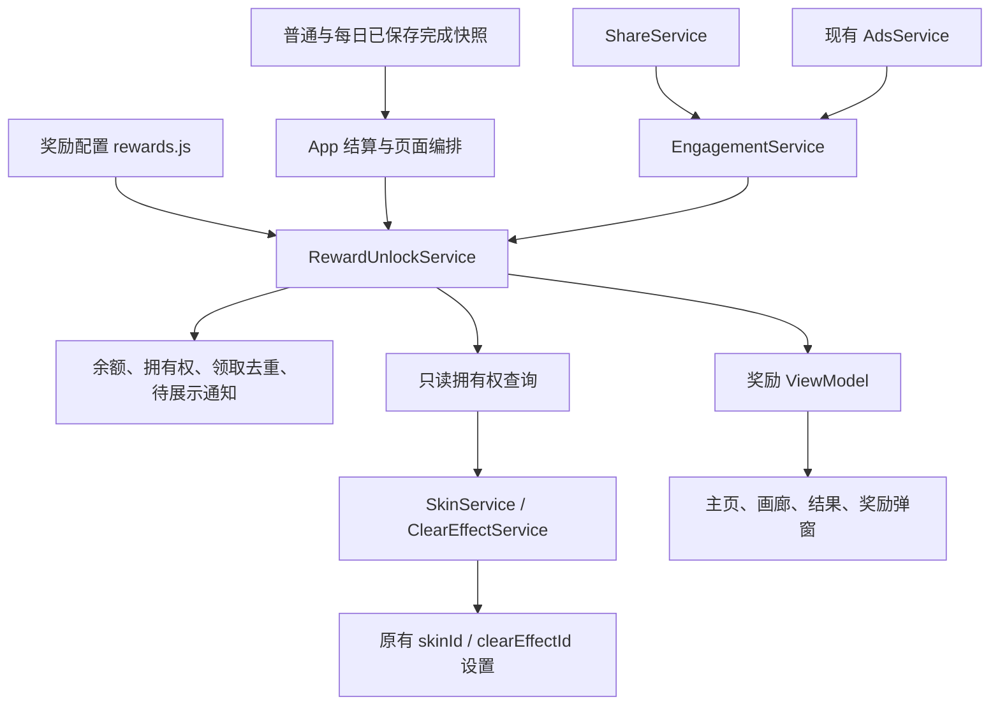

# 奖励解锁与货币系统实施方案

> 状态：本地运行时、Canvas UI、自动回归与文档已实施；正式广告、真实分享和真机验收仍待外部配置／设备验证。
>
> 需求确认：2026-09-03。代码审阅基线：`main@ad0fff4`，审阅前工作区干净。
>
> 本文冻结首版产品规则、存档合同、函数级修改边界、实施顺序及验收条件。旧专题文档描述的是当前实现；本方案落地时再同步其对应章节。

## 1. 已确认的产品规则

### 1.1 货币与拥有权

- 货币暂称“货币”，新存档余额为 `0`。
- 主线每关首次通关发放 `100`，同关重玩、刷新最佳时间、重复结算均不再发放。
- 主线普通题与 Portal 题采用同一规则，按关卡来源和稳定关卡身份结算。
- 每日挑战当天首次完整完成两小关发放 `500`。只完成入门小关不发放；同一天再次完整完成不发放。
- 每日结算沿用 `Asia/Shanghai` 及本轮固定的 `dateKey`。跨午夜完成旧日挑战，领取归属旧日，不占用新日资格。
- 默认经典主题 `classic` 与默认无特效 `none` 始终可用。其他主题、特效初始锁定。
- 解锁为永久拥有；货币购买一次扣费，后续切换免费。解锁不自动替玩家决定应用。
- 已拥有、当前应用、素材是否下载是三个独立状态。
- 主页从左到右排列：音乐按钮、货币余额、体力按钮；左侧头像仍保有独立位置。
- 首版按新玩家设计，不增加历史运营补偿、旧价格折算或老玩家专项迁移。

### 1.2 首版奖励表

奖励目录使用新的命名空间键，既有 manifest ID、选择 action 和设置 key 保持各自含义。

| 奖励键 | 既有项目 ID | 名称 | 条件 |
| --- | --- | --- | --- |
| `theme:classic` | `classic` | 经典主题 | 默认可用 |
| `theme:gem` | `gem` | 宝石主题 | 主线第 5 关通关 |
| `theme:fruits` | `fruits` | 水果主题 | 主线第 25 关通关 |
| `theme:animals` | `animals` | 动物主题 | 主线第 88 关通关 |
| `theme:desserts` | `desserts` | 甜点主题 | 消耗 10000 货币 |
| `theme:space` | `space` | 太空主题 | 消耗 10000 货币 |
| `theme:ocean` | `ocean` | 海洋主题 | 为该主题观看 1 次达到发奖条件的广告 |
| `theme:spring` | `spring` | 春天主题 | 为该主题观看 1 次达到发奖条件的广告 |
| `theme:music` | `music` | 音乐主题 | 为该主题观看 1 次达到发奖条件的广告 |
| `theme:vehicles` | `vehicles` | 交通工具主题 | 为该主题观看 1 次达到发奖条件的广告 |
| `theme:festival` | `festival` | 节日限定主题 | 为该主题发起分享流程 |
| `effect:none` | `none` | 无特效 | 默认可用 |
| `effect:fade` | `fade` | 逐渐消失 | 主线第 10 关通关 |

“音乐主题”是棋子主题；未来的背景音乐是另一种奖励类别。

一次广告只累计到发起时选定的奖励，不能同时解锁四个主题。节日限定采用现有提示分享的口径：`initiated === true` 即满足条件，取消分享也可能解锁。分享接口明确失败不解锁。

“通关第 N 关”指该指定关卡已完成，不以累计完成数量、历史最大编号或开发者工具的关卡可进入状态代替。当前 catalog 对应关系已经核对：

| 显示编号 | 稳定存档坐标 `setIndex:levelIndex` | 奖励 |
| --- | --- | --- |
| 5 | `1:2` | 宝石 |
| 10 | `2:2` | 逐渐消失 |
| 25 | `3:7` | 水果 |
| 88 | `4:55` | 动物 |

### 1.3 当前数值对应的获取节奏

当前主线共 92 关，首次全通合计 `9200` 货币。

- 一款货币主题价格 10000：主线全通后还需 2 个不同日期的每日挑战首胜，余额累计为 10200。
- 两款合计 20000：主线全通加 22 个不同日期的每日挑战首胜，累计为 20200。
- 仅依靠每日挑战，一款需要 20 次每日首胜。

这是已确认价格的直接结果，本方案不自动调整价格或额外增加货币来源。

## 2. 当前实现与可复用边界

以下为 `ad0fff4` 中已核对的实现，不代表奖励系统已经存在。

| 位置 | 当前职责 | 本次用途 |
| --- | --- | --- |
| `src/app.js:onPathCompleted()` | 普通成功结果、进度保存确认、体力返还、后续 engagement 通知 | 在真实通关并确认源进度已保存后接入奖励结算 |
| `src/app.js:completeDailyLevel()` | 两小关轮次与完整每日结果 | 只在整次挑战完成后触发每日货币结算 |
| `src/services/progress-store.js:recordCompletion()` | 普通完成、最佳时间和累计通关次数 | 保持原进度职责；奖励另查已保存完成事实 |
| `src/services/daily-progress-store.js:recordLevelCompletion()` | 每小关完成、`dayCompleted`、`dayFirstClear`、失败回滚 | 作为每日完成事实来源 |
| `src/services/skin-service.js:select()` | 当前主题和设置持久化 | 增加拥有权门禁与可靠的选择保存结果 |
| `src/services/clear-effect-service.js:select()` | 当前特效和设置持久化 | 增加同样的拥有权门禁 |
| `src/app.js:setSkin()/loadSkinPackage()` | 主题分包加载及成功后选择 | 解锁后的应用复用这一条路径 |
| `src/services/ads-service.js` | 共享激励广告实例、busy、有效 `attemptId`、`rewarded` | 直接复用，增加配置 placement 即可 |
| `src/services/share-service.js:shareHint()/initiate()` | 用户手势内同步发起分享，返回 `initiated` | 增加独立奖励分享入口，共用 `initiate()` |
| `src/services/engagement-service.js` | 提示及每日增次的外部行为编排 | 增加奖励广告／分享编排，使用同一份 AdsService、ShareService |
| `src/services/reward-service.js` | 服务端确认的 `daily_extra_entry` 及恢复 | 保持原职责与原 HTTP 合同 |

两个必须显式处理的细节：

1. 普通 `recordCompletion()` 会先更新内存，当前 App 随后再次检查 `progress.save() === true`。因此不能只看到 `firstClear === true` 或 completion policy 的初始 `persisted` 字段就发钱。
2. 当前 `ProgressStore.setSetting()` 不返回保存结果，SkinService 也未处理选择保存失败。为了保证“应用成功”的反馈可信，本期允许局部修正设置保存与选择的成功／失败处理。

## 3. 总体架构

首版新增两个运行时文件：一份声明式奖励配置、一项奖励解锁服务。钱包与永久拥有权放在同一服务、同一存档中，不再各建一套状态。



### 3.1 职责分配

- **奖励配置**：奖励对象、解锁条件、价格、次数和发放数值。
- **RewardUnlockService**：余额、资格判断、领取去重、扣费购买、拥有记录、通知记录与写盘。外部传入金额不能决定发放数量或价格。
- **ProgressStore / DailyProgressStore**：只输出各自已经保存的完成事实，不知道奖励价格、皮肤或货币。
- **EngagementService**：调用广告／分享，绑定发起目标，验证标准结果，再提交奖励服务。奖励流程使用独立 pending，不改变提示次数。
- **App**：连接结算、页面、通知和选择入口；只持有界面状态及异步请求标识，不成为第二个钱包。
- **SkinService / ClearEffectService**：通过只读拥有权查询决定能否选用；不发奖、不扣币、不调用广告。
- **CanvasRenderer**：消费 ViewModel，绘制并注册命中区域；不访问奖励存档、计算余额或修改拥有权。

### 3.2 奖励类别和条件分别扩展

类别首版支持 `theme`、`effect`。以后增加音乐、背景时，补对应选择服务与应用入口，复用奖励拥有记录。

条件首版支持 `default`、`ordinary_level`、`currency`、`rewarded_ad`、`share`。广告条件携带 `requiredCount`，本批全部为 1；累计逻辑可用配置中的正整数表达多次广告，并对 attempt 去重。

每个奖励首版只有一个条件。邀请新玩家且完成指定关卡属于未来独立的服务端确认条件，不提前实现组合条件编辑器、任务树或通用表达式执行器。

新注册的非默认项目没有有效奖励配置时，保持锁定并显示“暂未开放”；未知条件不能回退成免费。配置或资源 ID 校验失败的项目不可购买、不可请求广告／分享。

## 4. 奖励配置合同

新增 `src/config/rewards.js`，只包含 CommonJS 导出的可序列化数据。结构示例：

```js
module.exports = {
  schemaVersion: 1,
  currency: {
    ordinaryFirstClear: 100,
    dailyFirstComplete: 500
  },
  items: [
    {
      id: 'theme:classic',
      kind: 'theme',
      itemId: 'classic',
      unlock: { type: 'default' }
    },
    {
      id: 'theme:gem',
      kind: 'theme',
      itemId: 'gem',
      unlock: { type: 'ordinary_level', levelKey: '1:2' }
    },
    {
      id: 'theme:desserts',
      kind: 'theme',
      itemId: 'desserts',
      unlock: { type: 'currency', cost: 10000 }
    },
    {
      id: 'theme:ocean',
      kind: 'theme',
      itemId: 'ocean',
      unlock: { type: 'rewarded_ad', requiredCount: 1 }
    },
    {
      id: 'theme:festival',
      kind: 'theme',
      itemId: 'festival',
      unlock: { type: 'share' }
    }
  ]
};
```

正式配置必须补齐第 1.2 节的全部 13 项；示例不代表仅实现其中五项。

- 关卡条件存稳定坐标，显示“第 N 关”时由当前 catalog 投影；测试固定本期 5／10／25／88 的对应关系。
- 名称和预览继续取原 manifest，配置不复制图片路径、绘制参数或主题颜色。
- 奖励 ID 不重复，`kind + itemId` 必须对应已注册项目，默认项固定为 classic 与 none。
- 价格、奖励量、广告次数必须为正安全整数；非法配置不执行。
- 多次广告记录最多保留该奖励配置要求的有效 attempt 数；达到条件后永久拥有并停止累计。首版每个广告奖励只保存 1 个 attempt。
- 不在 manifest 中放解锁回调，也不在配置中放 `wx`、任意函数、脚本路径或网络地址。

## 5. 持久化、去重与读写失败

### 5.1 独立奖励存档

新增 key：`cleared:minigame:reward-unlocks:v1`。它与现有服务端每日增次 key `cleared:minigame:rewards:v1` 分开。

```json
{
  "schemaVersion": 1,
  "balance": 0,
  "claimedOrdinary": {},
  "claimedDaily": {},
  "ownedRewards": {},
  "adAttempts": {},
  "pendingNotices": []
}
```

| 字段 | 内容与约束 |
| --- | --- |
| `balance` | 非负安全整数；加减后仍须满足约束 |
| `claimedOrdinary` | `"setIndex:levelIndex": true`，每关最多发放一次 |
| `claimedDaily` | `"YYYY-MM-DD": "dayId"`，领取唯一性按日期，不按 dayId 版本分别计算 |
| `ownedRewards` | `"theme:gem": true` 等永久记录；两个默认项由固定规则提供，不依赖写盘才能使用 |
| `adAttempts` | `rewardId: [attemptId, ...]`；去重且只累计到原目标 |
| `pendingNotices` | 已解锁但尚未确认展示完成的奖励 ID，去重，数量不超过已拥有的非默认奖励数 |

余额、领取标记、拥有权、广告累计和新增通知在同一次存储写入中提交。所有变更先生成候选副本，`setStorage()` 明确成功后才替换内存状态；失败时保留旧状态。

不能用两个 key 分别“扣余额”和“存已拥有”；不能先更新界面余额再把持久化失败忽略。

领取索引不能按“最近 N 条”截断，否则被遗忘的日期或关卡可能再次发钱。首版只保存每关一项、每日一项、每个奖励有限广告凭证，不新增完整消费流水。将来达到存储预算时再设计压缩／分页，必须保留去重事实。

### 5.2 区分未建档与读取失败

当前 `WechatPlatform.getStorage()` 捕获异常后返回 `null`，不足以让新钱包区别“新玩家没有存档”和“现有存档暂时读取失败”。

仅在 `src/platform/wechat.js` 新增结构化 `readStorageResult(key)`：

```js
{ ok: true, found: false }
{ ok: true, found: true, value: storedValue }
{ ok: false, reason: 'storage-read-failed' }
```

该方法在平台层用 `getStorageInfoSync()` 的键列表确认存在性，再读取该 key；所有异常和非法接口结果返回失败。现有 `getStorage()`／`setStorage()` 签名不改。此设计使用微信已有存储接口，其同步键列表和异常处理形式见[微信官方类型定义](https://github.com/wechat-miniprogram/minigame-api-typings/blob/master/types/wx/lib.wx.api.d.ts#L14894-L14920)。

- 只有明确 `found:false` 才初始化零余额。
- 读取失败、损坏数据或未知 schema 不覆盖成空钱包；暂停资产变更，给出“奖励数据暂不可用，请重试”。默认外观和游玩继续可用。
- 不把丢失的领取索引单独重置为空后继续发钱；这种部分修复可能造成重复发放。
- 对保留字段做类型、日期、合法 ID、重复项及原型污染键检查。合法但暂未注册的历史奖励 ID 不因此获得使用资格，也不因一次运行的目录缺失而主动清除其拥有记录。
- 不提供 UI 可调用的任意 `addCoins(amount)` 或 `unlockAll()`。

### 5.3 源进度的只读完成快照

两个进度 Store 各新增 `exportRewardCompletions()`，通过平台的结构化读取查询已经保存的数据，并返回新分配的纯数据：

```js
// ProgressStore
{ ok: true, levelKeys: ['0:0', '0:1', '1:2'] }

// DailyProgressStore
{
  ok: true,
  days: [{ dateKey: '2026-09-03', dayId: 'daily-2026-09-03-v1', levelIds: ['intro-id', 'extreme-id'] }]
}
```

- 普通只输出当前 catalog 中 `completed === true` 的稳定坐标；不输出完成次数、最大编号或开发者工具解锁状态。
- 每日使用当前正式两关合同：有效日期、dayId、两项互异且索引正确的 levelId、两关均完成；不能只信一个顶层 `completed:true`，也不把单小关兼容记录当作本期 500 资格。
- 明确没有源存档返回空集合；读取／格式失败返回 `ok:false`，不拿未经确认的内存状态替代。
- 这两个方法只做本领域保存格式的投影，不读奖励配置，不发奖，不修改 schema、每日次数或云同步字段。

### 5.4 奖励服务接口

拟定 `RewardUnlockService` 的最小接口如下；方法名在实施中按本表固定，便于测试和审查。

| 接口 | 职责 |
| --- | --- |
| `view()` | 返回是否可用、余额、必要错误状态的只读副本 |
| `retryLoad()` | 只在奖励存档读取失败时重新读取；成功恢复原钱包，不能以零余额覆盖失败状态 |
| `status(rewardId)` | 返回拥有状态、条件及进度，不触发领取 |
| `canUse(kind, itemId)` | 只读使用权限查询 |
| `reconcile({ ordinary, daily })` | 根据成功读取的完成快照，结算尚未领取的普通／每日货币及指定关卡奖励 |
| `purchase(rewardId)` | 读取目录价格、重新检查余额和拥有权，同次写入完成扣费与拥有 |
| `recordAdCompletion({ rewardId, attemptId })` | 只接受广告类目标，检查 attempt 在本域中未被其他奖励使用；同目标重复结果不累计，达标时授予拥有权 |
| `recordShareInitiated({ rewardId, initiated })` | 只接受分享类目标，要求 `initiated === true` |
| `retryPendingSave()` | 保存本进程中已完成外部行为的原目标，不再索取一次行为 |
| `pendingNotices()` | 返回待展示 ID 的副本 |
| `acknowledgeNotice(rewardId)` | 只处理通知已确认状态，不再次发钱或解锁 |

变更结果统一提供 `ok`、`reason`、本次实际金额变化、发放源标识、新拥有奖励 ID 和必要的 `alreadyApplied` 状态。App 的结算提示依据本次提交结果，不依据一个永久 `owned` 状态重复播放“首次获得”。

候选状态不得跨 `await` 保存。外部行为返回后重新读取服务当前状态再提交，避免广告期间其他合法奖励到账后被旧副本覆盖。

## 6. 通关发放与恢复流程

### 6.1 普通关卡

1. Runner 正常产生成功结果，沿现有 completion policy 记录通关和成绩。
2. App 使用既有的 `progress.save() === true` 确认节点；失败时展示正常结果和待保存反馈，不提前显示已到账 100。
3. 读取已保存完成快照，调用 `reconcile()`。
4. 对不在 `claimedOrdinary` 中的有效关卡，增加 100 并记下领取标记。
5. 检查指定关卡奖励。例如本次完成 `1:2`，同次奖励写入还包括宝石拥有记录和待展示通知。
6. 结果中显示本关实际到账数；到现有结算展示时机、清除表现结束后展示解锁弹窗。

不能只在 `firstClear` 为 true 的一次性分支发钱。奖励写盘失败后重启时，源进度已经不是首次通关，但独立领取标记仍可证明尚未发放。

### 6.2 每日挑战

1. 入门小关仍按原流程保存并进入极难小关；不增加货币。
2. 最后一小关成功、日进度确认完整保存后，读取每日完成快照并调用同一奖励服务。
3. 该 `dateKey` 尚未领取时增加 500，同时记录日期与 dayId。
4. 本日重复完成、重复调用兼容别名、跨前后台、同日期更换题面版本，都不能再次增加 500。
5. 每日奖励不增加主线关卡进度，不触发第 5／10／25／88 关奖励，也不改变体力或每日进入次数。

### 6.3 中断和恢复

在冷启动、恢复前台、再次进入主页，以及用户点击奖励保存重试时执行一次恢复检查，不放进每帧绘制或 `buildModel()`。每次只遍历现存完成索引；奖励存档尚未成功读取时先 `retryLoad()`，读取成功后才结算。读取失败不对余额进行任何重建或覆盖。

| 中断点 | 恢复行为 |
| --- | --- |
| 普通／每日源进度尚未保存 | 奖励服务没有资格，按既有源进度保存失败合同处理；不承诺未保存通关在强退后仍能恢复 |
| 源进度已保存，奖励写入前退出 | 重启读取源快照，补记未领取项 |
| 源进度已保存，奖励写入失败 | 钱包与领取索引都不变；重试或重启后补记 |
| 奖励写入成功，结果动画或弹窗前退出 | 领取标记阻止重发，待展示通知可恢复 |
| 选择“稍后再说” | 保留拥有，确认通知，之后可从回廊应用 |
| 通知确认保存失败 | 本次可关闭弹窗；下次可能再次提示，但绝不再次扣币或发放 |

已有开发测试存档中的通关事实会被相同恢复机制结算；不另写“老玩家补偿”分支。测试新玩家必须使用空存档 fixture，不在真实工作区自动清除现有存档。

### 6.4 本地资产边界

本期货币、拥有权和广告累计均属于当前本地存档，不加入普通进度云合并，也不宣称跨设备资产同步或服务器防篡改。

完成快照若包含当前 ProgressStore 已接纳的云完成记录，仍按本地领取索引最多记一次；跨设备对同一事实分别记账属于本地版边界。未来启用跨设备货币／拥有权时，必须另行引入服务端资产账本，不能对余额做取最大值或相加合并。

## 7. 货币、广告与分享解锁流程

### 7.1 货币购买

1. 点击锁定的甜点／太空卡片，显示名称、价格 10000、当前余额和确认按钮。
2. 确认购买时由服务重新读取价格、余额与拥有状态；余额不足则无任何扣费。
3. 同次写入 `balance - 10000`、拥有记录、待展示通知。
4. 成功后原弹窗切换为“已解锁”，提供“立即应用／稍后再说”。
5. 连点或重复购买已拥有项目返回已拥有状态，不再扣费。
6. 下载或应用失败不撤销拥有，也不再次扣费；只重试应用。

### 7.2 广告解锁

在 `src/config/ads.js` 增加：

```js
rewarded: {
  // 保留现有 hint、dailyExtraEntry
  rewardUnlock: ''
},
rules: {
  // 保留现有提示和每日增次规则
  rewardUnlockRewardedEnabled: false
}
```

- `rewardUnlock` 与其他激励 placement 共用现有 AdsService；正式配置遵守现有单例广告位约束，使用同一激励广告单元。
- 目录只声明需要广告及次数，具体广告位和启用开关归 ads 配置所有。
- EngagementService 先检查奖励仍锁定、方法匹配、开关、广告位和平台支持，再请求 `showRewarded('rewardUnlock')`。
- 请求保存固定 `rewardId` 和请求标识，结果必须 `rewarded === true`，且有合法非空 attemptId、匹配 placement；不能根据停留时长、返回前台或“跳过”按钮推断完成。
- 由现有 AdsService 将 `isEnded === true` 转为标准发奖结果；不另加一套广告计时器或原生广告实例。
- 提前关闭、出错、busy、无广告位、未启用、无库存或 unit-mismatch 均保留锁定。当前广告奖励不配置分享替代条件。
- 看提示广告或每日增次广告，不累计到这四个主题。

当前真实广告配置为空且开关关闭。代码可以实现完整失败回退与模拟验证；正式广告奖励可用仍需真实配置和设备验证。

### 7.3 分享解锁

新增 `ShareService.shareReward(context)`，接收 `themes`／`effects` 画廊场景与原目标信息，共用现有 `initiate()` 和普通游戏截图卡片。首版实际调用来自主题画廊；恢复通知只处理已经拥有的项目，不自动重新发起分享。

- 从用户点击开始同步调用原生分享；中间不等待登录、网络、share intent 或一个必定失败的广告。
- `initiated === true` 后才提交节日限定拥有权，含“取消也可能解锁”的已确认口径。
- 该请求不调用 `shareHint()`：不能伪造 `play`／`daily` 场景来绕过它的现有场景校验。
- 不读写 HintAccessService、不占用每日提示免费／分享／广告的次序。
- 使用现有 `sv=1&scene=home` 分享 query 口径，不把奖励键、余额、拥有记录或身份塞进 query。
- 保持菜单／结果分享、邀请归因和每日增次原有开关及合同。

### 7.4 外部行为成功但保存失败

同一时刻只保留一个奖励外部解锁请求。完成广告／发起分享后写盘失败，服务保留原目标及该次已验证结果，界面提供“重试保存”；不要求玩家在同一进程内再做一次行为。

重试按当前存档重新生成候选状态。其他奖励广告／分享请求先等待该保存恢复，继续游玩不受此限制。切页后也不能把该凭证转给另一主题。

如果外部完成结果从未成功写入任何存储且进程被强制结束，本地无法在重启后证明该次行为已完成；这与现有提示保存失败边界一致。不能宣称这种情形已有跨重启恢复保证。

## 8. 页面、弹窗与应用合同

### 8.1 主页货币

- 仅增加余额展示，不增加商店页或货币充值入口；首页金币图标与余额直接绘制在背景上，
  不绘制灰色／半透明底板；余额字号与首页体力数字统一为 17px。
- 使用现有 Canvas 图标风格绘制简易货币符号，不新增图片依赖。
- 体力继续靠右；音乐按钮向左移动，在两者之间给货币留独立区域。
- 用动态宽高、safeTop、safeBottom、文字实际宽度安排位置，不固定为某张截图的坐标。
- 常规余额显示整数；长数采用紧凑“万”单位显示，购买确认中始终显示完整整数。
- 验收至少覆盖 320／375／390 宽度、不同安全区以及余额 0／9999／10000／100000，不能覆盖头像、音乐或体力命中区域。

### 8.2 主题与特效画廊

继续使用原 2×3 分页、返回路径、预览资源和卡片 action：`theme:<id>`、`effect:<id>`。

| 状态 | 展示与点击行为 |
| --- | --- |
| 默认／已拥有且已应用 | 显示当前选中标识 |
| 已拥有但未应用 | 点击走现有应用入口；主题素材未就绪时先加载 |
| 关卡锁定 | 显示“通关第 N 关解锁”，点击可查看条件，不应用 |
| 货币锁定 | 显示“10000 货币解锁”，点击打开购买确认 |
| 广告锁定 | 显示“观看 1 次广告解锁”，点击条件弹窗后由明确按钮发起广告 |
| 分享锁定 | 显示“分享解锁”，由明确按钮发起分享 |
| 外部行为／保存处理中 | 明确处理状态，阻止重复请求 |
| 未有效配置 | 显示“暂未开放”，不能绕过条件选用 |

锁定状态仍展示主包预览，条件文案优先于“点击下载”。只有获得使用权并请求应用时才下载正式主题分包；预览可继续按当前规则加载。

### 8.3 解锁弹窗

使用 App 中的一个临时 `rewardDialog` 状态，作为已有页面上方的 Canvas 弹层，不新增导航 scene。

- 支持条件／购买确认与“已解锁”两种内容状态，复用绘制骨架。
- 2026-09-04 视觉统一：货币购买确认、关卡／广告／分享解锁条件，以及“已解锁”通知
  （包括处理中、错误、保存重试和应用加载状态）全部采用普通成功结算的全宽深色横向面板，
  无圆角外框和额外全屏遮罩。商品预览居上，名称、条件／成功说明居中；单独“关闭”按钮居中，
  双按钮同排，并保留“关闭／确认购买”“稍后再说／立即应用”等原动作。
  面板内部先铺当前 scene 的底色，再使用 `strongPanel`，避免主题卡片或结果文案透出；
  不把截图中的青色硬编码到主题页。Renderer 仅用既有 `mode` 切换锁／完成图标和状态文案，
  不新增支付状态、scene 或 action，购买成功后的状态切换规则不变。
- 上述统一只覆盖游戏 Canvas 自绘弹窗；微信原生分享面板、激励视频和授权界面由平台绘制，
  不能由 `CanvasRenderer` 修改样式。
- 已解锁状态显示名称、现有预览、“立即应用”和“稍后再说”。
- 所有新拥有奖励均进入持久通知列表；同一奖励只入列一次。
- 结果页的新奖励在现有清除表现与结果显示时机之后展示；冷启动恢复的通知在主页展示。`play`／`daily`／`account` 中暂缓弹出。
- 多个通知逐一展示，同一时刻一个弹窗。已在条件弹窗中完成解锁的项目原位更新，不重复叠一层。
- 点“稍后再说”不失去奖励，不切换原选择。
- 余额到账本身在结果中反馈，不为每个 100／500 再新增一个必须关闭的奖励弹窗。

拟新增 action：`reward:unlock`、`reward:apply`、`reward:later`、`reward:close`、`reward:retry`。目标从当前弹窗的固定 rewardId 取值，不由任意 action 参数传入价格或奖励金额。

### 8.4 输入与异步边界

- 弹层出现时清除旧命中区域，只注册弹层命中；App 同时阻止底层 action 和画廊滑动，不能仅靠一层半透明矩形挡住视觉。
- 弹层切换、关闭、跨通知切换时清空 pointer／pressedId，取消旧点击候选，避免同名按钮被迟到松手触发。
- `onPointerStart/Move/End` 的弹层判断与 `performAction()` 的允许动作表配套；不能点击弹层空白后继续翻页或开始棋盘输入。
- 请求绑定奖励 ID、请求代次；广告结果只给原奖励。页面变化后可以保存拥有权和待展示通知，不能自动应用到后来浏览的项目。
- `onHide()` 保留有效外部请求和未确认通知，暂停显示；`onShow()` 恢复保存和显示机会，不凭回前台动作发奖。
- `dispose()` 使所有 UI 回调失效，并通过 EngagementService 的 `cancelRewardUnlocks()` 撤销尚未提交的奖励请求代次；迟到结果不能再由旧服务实例写钱包、弹窗、刷新图片或切换选择。已成功保存的拥有记录不回滚。普通 `onHide()` 不执行这项撤销。
- 购买和写盘均用当前状态执行；外部请求返回后不覆盖广告期间新增的余额。

### 8.5 立即应用与分包加载

1. 应用前再次调用 `canUse()`；UI 显示已拥有不能代替服务门禁。
2. 特效复用 `setClearEffect()`；主题复用 `setSkin()` 及 `loadSkinPackage()`。
3. 下载期间显示“加载中”，保留原主题。素材就绪后再次检查权限和请求代次，成功保存选择才提示已应用。
4. 加载／选择保存失败时保留原选择与永久拥有权，提供重试应用或稍后。
5. 离开该应用流程或选择其他项目会使自动应用请求失效；已完成下载仍可缓存，迟到回调不得切换主题。
6. 冷启动只恢复已拥有的保存选择；保存了非默认 ID 本身不代表拥有。无权使用的保存选择回退到 classic／none。
7. `get()`／`resolve()` 仍可为锁定卡片提供预览数据；限制落在实际选择与当前选择恢复边界，不能让预览获得应用权限。

### 8.6 ViewModel 字段

新数据由 `buildModel()` 和两个 descriptor 方法投影；全部为可复制数据，不把服务对象或函数交给 Renderer。

| 位置 | 拟定字段 | 用途 |
| --- | --- | --- |
| `model.currency` | `{ available, balance }` | 余额不可读时 `balance:null`，显示占位与可用反馈，不能伪装为余额 0 |
| 每个主题／特效 descriptor 的 `reward` | `{ id, owned, conditionType, displayLevel, cost, progress, requiredCount, action, actionEnabled, reason }` | 按条件提供所需字段，其余省略；保留原 descriptor 的 ID、名称和预览 |
| `model.rewardDialog` | `null` 或 `{ dialogId, rewardId, mode, state, title, message, primaryAction, primaryLabel, secondaryAction, secondaryLabel, preview }` | 单弹层显示；`mode` 为 `condition`／`unlocked`，`state` 为 `idle`／`working`／`loading`／`retry-save`／`error` |
| 普通／每日 `result.currencyReward` | `{ status, amount }` | `status` 为 `granted`／`already-claimed`／`pending`；只有已成功写入且属于该次结果的来源才显示本次正数到账 |

主题已有的 `assetState`／`assetProgress` 继续表达下载；不得把“已解锁”塞入 `assetState`，也不得用下载成功推导拥有权。Renderer 可格式化文字和数字，但不能自行从关卡编号或价格推断是否满足领取条件。

## 9. 精确运行时代码边界

本表是后续实施的运行时白名单。共新增 2 个文件、局部修改 11 个现有文件；发现额外必要改动时先在本方案记录根因和范围，不能顺手展开全仓重构。

| 文件 | 允许修改的函数／区段 | 允许承担的内容 |
| --- | --- | --- |
| **新增** `src/config/rewards.js` | 整个新文件 | 第 1 节配置和固定条件数据，禁止执行逻辑 |
| **新增** `src/services/reward-unlock-service.js` | 整个新文件 | 第 5 节的存档、事务、校验、查询、去重及通知；只能消费纯完成快照与标准外部结果 |
| `src/platform/wechat.js` | 存储方法相邻区段，新增 `readStorageResult()` | 结构化区分存在、缺失、失败；不改旧 API 签名，不加入任何奖励规则 |
| `src/services/progress-store.js` | 新增 `exportRewardCompletions()`；局部修改 `setSetting()` | 持久完成投影；设置用候选副本保存，返回 true／false，失败恢复原设置。不得新增余额／拥有字段或更改普通通关和云合并算法 |
| `src/services/daily-progress-store.js` | 新增 `exportRewardCompletions()` | 已保存的完整两关日完成投影；复用日期／格式校验，不改进入、授权增次、两关记录或 schema |
| `src/services/skin-service.js` | `constructor()`、`select()` | 注入只读 `canUse` 能力；启动恢复与选择门禁；设置保存成功才更新 currentId。注册、颜色合并、manifest 与预览投影不改 |
| `src/services/clear-effect-service.js` | `constructor()`、`select()` | 相同的使用门禁与选择成功判断；不重写归一化、动画参数、type 白名单或预览逻辑 |
| `src/services/engagement-service.js` | 构造器注入；新增 `rewardUnlockState()`、`requestRewardUnlock()`、`cancelRewardUnlocks()` | 固定目标、广告／分享请求、标准结果校验、保存重试和销毁代次保护；不修改 `requestHintUnlock()` 或每日增次方法的规则 |
| `src/services/share-service.js` | 新增 `shareReward()` | 合法场景校验、简单分享 payload，共用 `initiate()`；不改变 hint／result／menu／attribution 路径 |
| `src/config/ads.js` | `rewarded.rewardUnlock`、`rules.rewardUnlockRewardedEnabled` | 专用 placement 和显式开关；保留提示 fallback 和每日增次配置 |
| `src/bootstrap.js` | require 与服务构造／注入区段 | 建立一个 RewardUnlockService，注入 App、EngagementService；复用现有 Ads／Share 实例，保持首帧离线可启动 |
| `src/app.js` | 第 9.1 节列出的区段 | 结算、ViewModel、弹窗、输入与应用编排，禁止直接维护钱包或重复实现资格公式 |
| `src/ui/canvas-renderer.js` | `render()`、`drawHome()`、`drawThemes()`、`drawEffects()`、`drawResult()`、`drawDailyResult()`；新增货币／奖励弹层绘制 helper | 消费数据绘制，复用 Canvas primitives、主题 token 和 InteractionMap；不访问存储或奖励服务 |

### 9.1 App 内部允许修改区段

| 位置 | 精确目的 |
| --- | --- |
| require、`constructor()`、`start()` | 奖励服务依赖、通知和请求状态；将主题／特效服务初始化放在普通／每日 Store 与奖励恢复之后，仍早于 Renderer 构造 |
| `onPathCompleted()` 普通成功并确认保存后的区段 | 调用奖励恢复／结算，给结果附本次到账；不改失败判定、路径快照、Portal、用时和体力计算 |
| `completeDailyLevel()` 最终整日成功区段 | 完整每日奖励结算；第一小关转场路径不加发钱逻辑 |
| 新增 `recoverRewardUnlocks()` | 必要时先 `retryLoad()`，从两个 Store 的持久快照调用 `reconcile()`，更新 UI 反馈；启动、回前台、进入主页和显式重试复用 |
| `buildModel()`、`themeDescriptors()`、`effectDescriptors()` | 只读余额、条件、已拥有、有效外部能力及弹层模型；这些方法禁止提交奖励 |
| `performAction()`、`onPointerStart/Move/End()` | 弹层动作允许表、防穿透与滑动阻断；原 action 兼容保留 |
| 新增 `openRewardDialog()`、`requestRewardUnlock()`、`applyReward()`、`dismissRewardDialog()`、`showNextRewardNotice()` | 局部弹层编排；金币与资格计算全部调用服务 |
| `tick()` | 仅在安全场景和结果可见时展示已经保存的通知，不每帧扫描进度或写盘 |
| `setSkin()`、`prepareCurrentSkinAssets()`、`loadSkinPackage()` | 应用门禁、真正选择成功检查、下载完成后重新验证及失效请求保护 |
| `setClearEffect()`、`currentEffectId()`、`resolveClearEffect()`、`fallbackClearEffects()` | 实际选择门禁，所有 App 兼容默认应用回退到 none；不能通过旧 fade fallback 绕过锁定 |
| `onHide()`、`onShow()`、`dispose()` | 外部请求与弹层生命周期、恢复、销毁后回调阻断 |

`setSkin()` 和 `setClearEffect()` 保留既有布尔返回合同：前者在需要异步下载时表示请求被接受，不表示已经应用；加载结果和弹层反馈由同一请求代次更新。同步选择失败必须返回 false。不得让旧调用者突然收到 Promise 或混合返回类型。

构造阶段的恢复只调用奖励服务并保留结果，不访问尚未建立的 Renderer、弹窗或 pointer。完成两个选择服务、Renderer 和页面状态初始化之后，才在 `start()` 安排待展示通知。

直接 `new ClearedApp()` 与生产 bootstrap 使用相同奖励默认规则，不能只有生产注入时才锁定。主题／特效服务未取得有效拥有权查询时，也只允许 classic／none；测试若需要自定义已拥有外观，必须显式提供受控 fixture。

### 9.2 本期不修改的运行时范围

- `core/**`：Runner、胜负规则、Portal、路径与题面校验。
- `data/**`：所有关卡 JSON／生成 JS、catalog、solutions、每日题面。本期只读取 catalog 映射。
- `src/gameplay/**`：RunContext、completion policies、BoardInputController 的职责保持原边界，奖励接入点在 App 已保存结算之后。
- `src/ui/board/**`：棋盘、Portal 和清除表现；奖励弹层不依靠修改棋盘规则阻止输入。
- `src/skins/**`、`src/effects/**`、`src/mechanics/**`、`assets/**`：既有 manifest、顺序、素材和机制定义。
- `src/services/ads-service.js`、`src/services/subpackage-service.js`：复用现有能力；不重新建广告单例或素材加载队列。
- `src/services/reward-service.js`、账号／同步／HTTP／行为事件服务及其配置：不扩展服务端每日增次合同，不把本地奖励包装为后端已确认资产。
- `src/services/hint-access-service.js`、`src/services/hints/**`、提示规则：奖励分享不得改变提示访问许可。
- `src/services/stamina-service.js`、体力／每日次数配置、`src/services/audio-service.js`：不调整体力经济、次数或音乐播放逻辑。
- 根目录 `game.js`、打包／项目配置、`pages/**`、旧小程序入口：本期无修改理由。

## 10. 测试边界与验收矩阵

### 10.1 测试文件

新增：

- `tests/reward-unlock-service.test.js`：配置、存储三态、金额、去重、指定关卡、购买、广告累计、分享和恢复。
- `tests/reward-unlock-app.test.js`：真实 App 结算／触摸／生命周期、两关每日、弹窗、下载与保存重试。
- `tests/reward-unlock-renderer.test.js`：主页排布、条件文案、只读绘制、弹层命中隔离。
- `tests/helpers/reward-fixture.js`：仅供测试，显式构造拥有记录、可控日期、广告／分享结果与分 key 读写失败；复用已有 fakeApi，不造生产解锁后门。

局部补充或调整：

| 现有测试 | 修改范围 |
| --- | --- |
| `tests/run.js` | 注册新增测试，沿现有 `module.exports = run` 入口执行 |
| `tests/progress-store.test.js`、`tests/daily-progress-store.test.js` | 已保存快照、失败读取不冒充内存成功；设置保存失败回滚 |
| `tests/skin-service.test.js`、`tests/clear-effect-service.test.js` | 未拥有的选择拒绝、保存选择权限、设置返回值与失败路径 |
| `tests/theme-system.test.js`、`tests/clear-effect-system.test.js` | 原资源／动画用例补显式拥有 fixture；新增 locked、下载后仍需权限，不删除原资源／动画断言 |
| `tests/share-service.test.js`、`tests/engagement-service.test.js` | 独立奖励入口、原行为回归、固定目标与 pending |
| `tests/account-bootstrap.test.js` | fakeApi 的结构化存储所需接口、奖励服务注入和离线启动 |
| `tests/stamina-renderer.test.js` | 主页音乐与体力之间新余额区域；替换二者必须直接相邻的旧断言，保留体力交互断言 |
| `tests/app-portal.test.js` | 原 fade 动画用例显式赋予拥有权；只调整 fixture，保留 Portal 路径与动画断言 |
| `tests/architecture-boundaries.test.js` | 约束奖励配置无行为、Runner／棋盘不依赖奖励、Renderer 不读写存储，且旧服务器奖励与提示存档不被新流程修改 |

其他测试先原样运行。只有因“默认全可用”的旧 fixture 与新规则冲突时，才在实施记录中列出该测试文件和具体原因；不能通过放宽生产门禁或删掉断言让测试变绿。

### 10.2 最小有效回归

| 场景 | 必须验证的结果 |
| --- | --- |
| 空存档启动 | 余额 0，classic／none 可用，其他全部锁定；首次读取失败不能冒充空存档 |
| 普通第一遍成功 | 只增加 100，保存领取坐标 |
| 普通重玩／刷新纪录 | 余额不再增加；成绩行为正常 |
| 主线 Portal 首通 | 与普通题同样增加 100，不修改 Portal 核心状态 |
| 指定第 5／10／25／88 关 | 只授予对应奖励；通知一次；“稍后”保留拥有 |
| 累计完成 5 个其他关／仅开发工具解锁 | 不得到宝石；通过第 88 关本身可得到动物，不凭最大编号补送其他里程碑 |
| 每日只完成第一小关 | 0 货币 |
| 每日两关完成 | 500；同日重玩、重复结算、换 dayId 均不再给 |
| 午夜和次日 | 本轮按原 dateKey；新日首次可再得 500；debug 无限进入不突破每日一次 |
| 源进度保存失败 | 未保存完成不能被奖励快照输出 |
| 源已保存／奖励保存失败／重启 | 最终补记一次；不因 firstClear 已变 false 漏发 |
| 奖励成功／弹窗前重启 | 不重复发钱，仍能展示未确认奖励 |
| 余额 9999／10000／20000 | 分别不能买、能买一款、能买两款；余额不能为负 |
| 连点／重复购买 | 同一奖励只扣一次；已拥有不扣费 |
| 购买存储失败 | 余额与拥有权都不变；恢复后可重试 |
| 广告完整／早关／错误／缺失结果 | 只标准成功结果计入；失败保持锁定 |
| 广告 attempt 重复／跨目标 | 同一结果只累计一次，不转给其他奖励 |
| 广告次数配置为 2 的服务用例 | 两个不同成功 attempt 才拥有，重复第一个不达标；正式首版配置仍全部为 1 |
| 奖励分享 initiated／明确失败 | 前者解锁，后者不解锁；提示当日许可和次数完全不变 |
| 外部成功后保存失败 | 同进程重试原目标不再次拉起分享／广告 |
| 广告期间其他货币到账 | 结果回来后余额保留新增款项，不被旧快照覆盖 |
| 已拥有但下载失败 | 拥有权保留，原主题保留，重试不扣钱 |
| 存在非默认设置但无拥有记录 | 启动回退经典／无特效；直接选择也被拒绝 |
| 应用存档失败 | 原选择保留，拥有权保留，不能反馈已应用 |
| 弹层拖动／空白点按／旧 pointer | 不穿透到底层按钮、分页或棋盘 |
| 切页、隐藏、恢复、销毁 | 凭证绑定原目标；按安全时机展示；无迟到自动应用 |
| 损坏格式／未知 schema／非法金额 | 不覆盖原始钱包，不静默重置索引后重发；默认外观可用 |
| 绘制与查询重复执行 | 不增加余额、不领取、不写盘、不调用广告或分享 |

### 10.3 实施完成后的命令

在项目根目录执行，长日志写入临时目录：

```sh
node tests/run.js > /tmp/cleared-reward-tests.log 2>&1
node scripts/check-package-budget.js > /tmp/cleared-reward-package.log 2>&1
git diff --check
git diff --stat
git status --short
```

单独 `node tests/foo.test.js` 不视为执行成功；这些测试依靠聚合入口调用导出的 run。本期不修改 sprite sheet，不需要为本任务重生成关卡模块或美术素材。

### 10.4 微信开发者工具与真机

- 验证空存档初始状态、主页余额位置、320 宽等效窄屏与安全区、长余额及体力展开。
- 真实触摸锁定卡片、购买确认、解锁通知、稍后应用；弹层不得穿透或触发分页。
- 真正走完普通与每日两关流程，关闭／重启后核对金额和拥有记录。
- 正式广告位：成功发奖、提前关闭、无库存／错误、后台回调、与提示广告的单例忙碌隔离。
- 分享：原生界面能拉起、取消回流后的已确认口径、接口不支持时反馈；不把 `initiated` 说成好友已收到。
- 分包下载失败和重试、下载时返回／选择其他主题、应用后重启恢复。
- 验证新的结构化存储读取在实际小游戏运行环境中的键存在性及错误反馈。

Node 测试不能替代上述广告、分享、触控、下载和设备证据。正式广告开关只在真实广告位及联调完成后开启，不伪造广告成功。

## 11. 实施顺序与阶段出口

实施应在 `codex/` 功能分支隔离进行；开始前重新检查工作区。以下阶段是执行顺序和验收点，不要求每阶段再次索取用户确认。

| 阶段 | 交付 | 出口条件 |
| --- | --- | --- |
| 1. 数据与存档 | rewards 配置、结构化读取、两个源快照、RewardUnlockService 及服务测试 | 数值、事务、去重、读取失败、广告次数与已保存恢复测试通过 |
| 2. 结算接入 | bootstrap／App 注入，普通 100、完整每日 500、指定关卡授予与恢复 | 真实 App 的首次／重玩／每日两关／跨日／中断恢复通过 |
| 3. 使用门禁与购买 | 两个选择服务、App 统一入口、设置保存结果、画廊锁定与扣币购买 | action、直接服务调用、启动保存选择三条路径均不能绕过；购买写盘失败不损失余额 |
| 4. 外部解锁 | EngagementService、奖励分享入口、广告配置 | 一次有效广告／发起分享解锁；失败和 pending 重试正确；旧提示／增次测试通过 |
| 5. 页面与通知 | 主页余额、结果到账、统一条件／解锁弹层、加载和生命周期保护 | 布局／命中／异步回归通过，开发者工具完成本地流程检查 |
| 6. 文档与最终验收 | 更新专题文档、全量回归、包体、差异白名单、实际设备证据 | 清楚区分实现完成、模拟验证、真机结果、正式广告可用状态 |

每阶段可提交一个可审查的完整变化，但集成途中不能把暂时没有门禁的版本当作最终奖励系统交付。未来音乐、背景、邀请奖励不夹带到本次实现。

## 12. 实施时需要同步的文档

| 文件 | 实施后应更新内容 |
| --- | --- |
| `README.md` | 100／500 获取、默认锁定、主页余额、解锁能力、两个新模块；更正当前“未实现货币”的说明 |
| `docs/theme-system.md` | 原“主题初始均可用”改为新奖励条件，拥有／应用／下载区别与购买行为 |
| `docs/corridor-and-clear-effects.md` | none 默认、fade 第 10 关、弹层与命中、选择回退及使用权限 |
| `docs/daily-challenge-mode.md` | 两关整日首胜 500、按日去重、跨日归属及保存恢复 |
| `docs/stamina-system.md` | 只更新首页音乐／货币／体力排布和对应验收；体力规则不变 |
| `docs/user-account-sharing-ads-integration.md` | 明确新的本地奖励域与旧服务端每日增次域、共用广告／分享入口及本地资产同步边界 |
| `docs/reward-unlock-system.md` | 将已实现阶段、真实接口、测试结果及仍未执行的设备／发布项逐项记录，不能只把标题改成“完成” |

提示专题文档的规则不变；必要时只补奖励分享独立性的交叉引用。关卡、Portal、素材协议和玩法架构文档不为本方案重写。

## 13. 后续扩展触发条件

- **新增主题／特效**：注册既有 manifest，增加奖励目录项及配置校验；漏配仍锁定。
- **新增音乐／背景**：增加该类资源 manifest／选择服务与明确应用分支，奖励服务沿用拥有／花费合同；不在本期添加空目录或未调用的播放器抽象。
- **广告累计多次**：修改该奖励的 `requiredCount`，沿用已去重 attempt 记录；已拥有记录不因提高门槛而收回。
- **邀请新玩家并通关**：在真实后端定义新玩家判定、归因、指定关卡条件和一次性 grant。客户端只有在取得合法服务端确认后授予拥有权；不能用发起分享或回前台代替新玩家通关证明。
- **跨设备资产**：独立设计账户资产账本和同步冲突处理，不能复用普通完成集合的合并算法处理余额。
- **多条件组合／任务活动**：出现具体产品需求后扩展条件协议；首版不实现运行任意表达式的规则引擎。

## 14. 本次方案交付与验证记录

- 在 `codex/reward-unlocks` 分支基于 `main@ad0fff4` 实施；未修改核心玩法、关卡／解答、Portal、棋盘渲染、manifest、素材、体力、提示许可、账号／云同步或服务端奖励合同。
- 新增声明式 `src/config/rewards.js` 与 `src/services/reward-unlock-service.js`；局部修改第 9 节列出的 11 个现有运行时文件。钱包三态读取、原子写盘、恢复补记、购买、广告／分享凭证、通知、拥有权门禁、结果反馈和弹层均已接入。
- `node tests/run.js` 本轮 63 组通过；覆盖主线首通／重玩、完整每日与固定 dateKey、指定关卡、购买、存储失败、广告／分享、旧状态竞态、使用权限、弹层隔离、窄屏布局和只读绘制。一次复跑遇到既有实时 elapsedMs 从 0 变 1 的已知计时波动，随即完整复跑通过，没有放宽断言。
- `node scripts/check-package-budget.js` 通过：主包源码估算 2,795,757 bytes（2.666 MiB / 3.20 MiB），总包 16,086,697 bytes（15.341 MiB / 18.00 MiB）；这是源码预算，不替代上传后的平台包体结果。`git diff --check` 通过。
- 微信开发者工具 Stable 2.02.2608060、基础库 3.16.2 已自动热重载编译，调试器为 Errors 0、Warnings 1（既有 HarmonyOS 平台提示）。在 iPhone 12/13 Pro 与 iPhone 5 画布实际观察到 2300 余额、宝石解锁通知、音乐／余额／体力排列和窄屏弹层；Canvas 鼠标注入未形成可确认的触控关闭证据，因此不把它记录为真实交互通过。
- 正式广告位仍为空且专用开关关闭。真实广告完成／早关／无库存、原生分享取消回流、真机触控与生命周期、真机分包失败重试及上传后包体尚未验证；这些发布项不能由 Node 或模拟器视觉观察替代。

## 15. 审查修复记录（2026-09-04）

本轮只修复以下两个缺陷及特效文档冲突，不改变奖励数值、条件、存档格式、玩法、素材或后端合同。

- **源进度写盘失败后的重试误报已领取**：普通结果仍为 `pending` 时，`reward:retry` 先重试 `ProgressStore.save()`，保存失败返回 false 并保持 pending。成功后才导出持久完成快照并结算；普通／每日 pending 结果只有在快照确实包含对应 levelKey／dateKey 且结算成功时，才能更新为 `granted` 或 `already-claimed`。不依赖 `firstClear`，钱包写盘失败后的既有恢复路径保持有效。
- **首通货币领取标记阻断后续同关卡奖励**：`RewardUnlockService.reconcile()` 对每个精确匹配的已完成 levelKey 始终检查当前配置奖励；只有货币发放受 `claimedOrdinary` 去重控制。新增拥有权和通知仍同次写盘，失败回滚；已拥有项目不重复通知，也不按最高关卡编号推定其他里程碑。
- **回归证据**：`tests/reward-unlock-app.test.js` 使用真实 App、ProgressStore 和奖励服务，新增普通源写入持续失败／恢复补发／重复重试与重玩、钱包写入失败恢复、普通与每日持久快照证据检查。`tests/reward-unlock-service.test.js` 新增同一钱包跨配置版本补授同关卡奖励、奖励单独写入失败回滚、重启通知恢复与重复恢复去重，并验证第 88 关不补送第 5／10／25 关奖励。先只加入测试时，这两组在旧实现下失败，其余 61 组通过（`/tmp/cleared-reward-review-before-fix.log`）。
- **本轮最终验证**：`node tests/run.js` 重新执行，63 组全部通过（`/tmp/cleared-reward-review-tests.log`）。`node scripts/check-package-budget.js` 全部通过：主包源码估算 2,797,033 bytes（2.667 MiB / 3.20 MiB），总包 16,087,973 bytes（15.343 MiB / 18.00 MiB），日志为 `/tmp/cleared-reward-review-budget.log`。`git diff --check` 通过；保留原有未提交改动，不提交、合并、推送或发布。
- **文档同步与边界**：`corridor-and-clear-effects.md` 已明确 `none` 默认可用、`fade` 由主线第 10 关解锁，暂不新增其他特效解锁方式。README 不变：本轮恢复既有承诺的奖励行为，不新增能力、入口或命令，且按本轮白名单仅修改这两份专题文档。
- **仍未执行**：本修复版未另行执行微信开发者工具交互验收、正式广告、原生分享或真机触控／生命周期／分包验收，也未执行发布上传或取得上传后包体结果。第 14 节是原实施阶段的开发者工具观察记录，不作为本轮设备通过证据。
